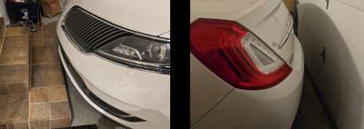
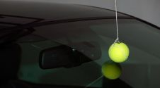
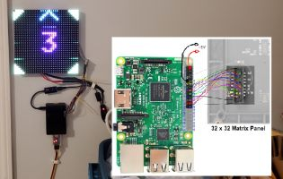
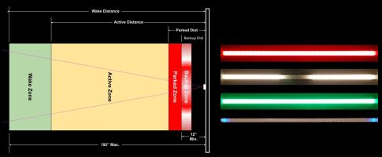

# About this Project
{: .no_toc }

---

  

## The Problem

Do you have limited depth in your garage?  For ours, pull forward just a little too far and you scrape the spoiler on steps.  Don't pull forward far enough and garage door smacks the bumper!

Of course, there are no-tech options... like hanging a tennis ball from a string. Or adding tape to the floor or wall.  Or one of a dozen other "simple" ways to provide guidance to the driver.  

  

But these basic solutions tended to suffer the following shortfalls or issues:

- For me, the tennis ball on the string always seemed to get in the way or get tangled around something like a ladder when using the garage for project builds or other activities.

- Tape or other static visual aids were unreliable, resulting in inconsistences with the final parked position or were hard to see at night in a dark garage.

- If a visual aid relied on the car's camera (such as a backup cam), it failed if the camera was wet or obscured due to rain or snow on the lens.

- Most importantly, these "no-tech" solutions could not be integrated into a Home Automation system and provide options like "car presence" detection that could be used for other automations or processes.

## The Original Solutions

For my first stab at a technical solution, I created the first parking assistant using a Raspberry Pi 3 and a 32x32 LED matrix.  

  

But this was overly complicated, requiring a lot of wiring and multiple power supplies.  It was also expensive and changing any settings required stopping the Python application, manually editing the source code and restarting the app.  While it did work, after I discovered the ESP8266 and LED strips, I realized I could create a much simpler and less expensive system that would have all the same features (and eventually even more).

  <!-- Header Row -->
  
Pi Version

  
&emsp;&emsp;

  
ESP Version

  
&nbsp;

  <!-- Row 1 -->
  
RPi 3b Starter Kit:

  
$90+

  
ESP8266:

  
$3

  <!-- Row 2 -->
  
LED Matrix:

  
$40+

  
LED Strip:

  
$9

## The New and Improved Solution

The original system used an ESP8266 and a two foot strip of 5V WS2812b LEDs.  This went through a number of upgrades based on feedback from others, eventually adding support for the ESP32 and numerous new features.  And while it offered a basic web interface for modifying the settings, it was still pretty rudimentary.  This new version, starting with v0.60, rebuilds the system from the ground up with a new web app and many of the previously requested new features.

  

### Key Features:
- 4 variable distance parking zones, including a wake zone, an active zone, a parked zone and a backup zone, each with its own customizable color.

- Five different approach zone effects, that can be used to visually show the car approaching the final parking location.

- Automatically goes to standby or sleep mode and only awakens when a car enters the wake zone

- Supports any number of LEDs, up to 600, and is designed so the LED strip can be mounted horizontally or vertically.

- All options and settings made through an embedded web interface. No hubs, separate apps or external systems required.

- Over-the-air firmware updates, with a manual OTA option available for uploading your own modified source code.

- Easily swap the system to use inches or millimeters for zone distances.

- _**Optional**_: Add a side sensor to also provide lateral guidance and to improve overall system accuracy.

- _**Optional**_: Enable MQTT for integration into third party systems (MQTT broker required).

- _**Optional**_: New HTTP API allows integration with external systems without a broker or other intermediate system.

- _**Optional**_: Dynamic Home Assistant Discovery.  Click a button to automatically integrate the system.  Choose only the entity groups you need or want.

- _**Optional**_: New **ACCESS POINT (NO WIFI)** mode!  You can now install and use the system in a location like a garage or outbuilding that may not have reliable WiFi.

There are many more features and improvements in this latest version.  Many of these will be covered in additional sections of this guide.

## Caveats and Hardware Support
This system was built to provide as much flexibility as possible, but replacing some hardware may require firmware modifications.  For example, if you wish to use a different ESP32 model (e.g. S3, C2) or wish to use wired sensors other than the AM312 PIR or VL53L0X, you may need to slightly modify and compile your own version of the firmware.  

The [written guide](https://resinchemtech.blogspot.com/2026/08/parking-assistant-2026.html) includes a detailed parts list indicating which components are interchangeable and which might require code modifications.  See the the [Modifying the Firmware](modifications) topic for more information on how to modify the firmware for your own hardware.

**I do not have the bandwidth to maintain multiple versions of the firmware for different hardware combinations. Please do not submit issues requesting support for alternate hardware.**
{: .label .label-yellow }

### Questions?
If you can't find an answer here or in the companion [Build Guide](https://resinchemtech.blogspot.com/2026/08/parking-assistant-2026.html), please post your question in the [Discussion](https://github.com/Resinchem/ESP-Parking-Assistant/discussions) area of the repository.  I will do my best to provide guidance as time allows.

  <a href="{{ '/' | relative_url }}" class="btn btn-outline"><- Previous: Welcome</a>
  <a href="{{ '/concepts' | relative_url }}" class="btn btn-purple">Next: Concepts & Terminology -></a>

