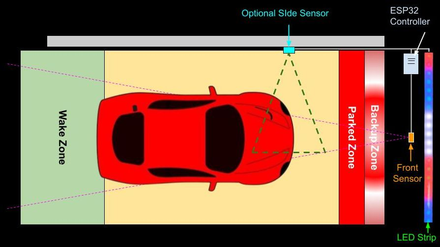

# Advanced Technical Information
{: .no_toc }

---

  

These sections contain the "under the hood" technical details of the Parking Assistant system. This information is generally not required for standard setup, configuration, or daily use. Instead, it is provided for the curious, the tinkerers, and those brave souls looking to modify the firmware for their own bespoke projects.

> **🐉 Here Be Dragons** By entering these pages, you are leaving the "safe zone" of standard consumer setup. I am happy to answer questions about the official firmware, but if you start rewriting the logic or swapping out hardware components, you’re officially the Captain of your own ship. I simply don't have the bandwidth to troubleshoot custom forks!
{: .important }

## System Architecture Overview
The system's flexibility allows for various installations to meet different parking needs:

   

The addition and use of a side sensor is optional, but it can be placed on either the right or left hand side of the vehicle.  The LED strip can be mounted vertically as well as horizontally and the ESP32-based controller can be placed wherever convenient (within a reasonable "wiring" distance from the sensor(s) and LED strip).

&nbsp;|Front Sensor|Side Sensor
:---|:---:|:---:
Supported Type|TFMini-s|VL53L0X
*Range|12"-192" (305-4980 mm)|2"-48" (50-1220 mm)
Required| YES | No

<i>*Published ranges for these sensors may be slightly different, but they may behave erratically near the upper/lower end of the range.  The values shown above are the ranges permitted by the Parking Assistant system.</i>

### HTML and the UI
To keep modifications straightforward, the entire web application (HTML, CSS, and JavaScript) is stored as embedded strings within a dedicated `html.h` header file. This means you don't need to worry about managing SPIFFS assets for the UI—just compile and flash.  You also do not need to install a separate app on your computer, tablet or phone to interact with a controller.  WiFi is all that is needed... <i>and even that is optional after onboarding</i>!

## In This Section

* **[Configuration Files]({{ '/advancedconfig' | relative_url }})** – Detailed JSON mappings of the `config.json` and `discovery.json` files.
* **[Partitions and Flashing]({{ '/advancedpartitions' | relative_url }})** – Memory offsets and partition tables for manual flashing via the Arduino IDE or third-party utilities.

---

  <a href="{{ '/modifications' | relative_url }}" class="btn btn-outline"><- Previous: Modifying the Firmware</a>
  <a href="{{ '/advancedconfig' | relative_url }}" class="btn btn-purple">Next: Configuration Files -></a>

