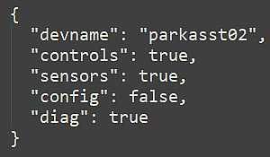

# Configuration Files
{: .no_toc }

---

<p align="center">
  
</p>

The Parking Assistant system utilizes specialized configuration files to store your settings. These files are written/read from the SPIFFS (Serial Peripheral Interface Flash File System) area of the ESP32's memory, ensuring your preferences—from Wi-Fi credentials to zone distances—are preserved across reboots and power cycles.  The system uses the LittleFS format for these files.

> **⚠️ A Note on Manual Editing**<br>While these files are accessible via certain third-party utilities, **manual modification is not recommended.** A single missing comma or a stray bracket in a JSON file can prevent the controller from booting. If you need to troubleshoot, use the "Config Dump" feature in the [Controller Commands]({{ '/commands' | relative_url }}) menu to view the raw data safely. Otherwise, the web application should be used to make changes to the system settings or options.
{: .warning }

### 1. Main Configuration (`config.json`)
This is the master configuration file for the system settings. It stores system hardware settings, startup preferences, and integration details.

_Example primary config.json file_

```json
{
  "device_name": "parkasst-02",
  "no_wifi_mode": 0,
  "manual_ap_name": "---",
  "manual_ap_pwd": "---",
  "led_data_pin": 19,
  "tfmini_rx_pin": 16,
  "tfmini_tx_pin": 17,
  "tof_dat_pin": 21,
  "tof_clk_pin": 22,
  "onboard_led_pin": 2,
  "led_count": 36,
  "right_led_wiring": 0,
  "led_brightness_active": 100,
  "led_brightness_sleep": 5,
  "led_effect": "Out-In",
  "use_boot_leds": 1,
  "color_standby": "#0000ff",
  "color_wake": "#00ff00",
  "color_active": "#ffff00",
  "color_parked": "#ff0000",
  "color_backup": "#ff0000",
  "uom_distance": 0,
  "wake_mils": 1143,
  "start_mils": 914,
  "park_mils": 356,
  "backup_mils": 305,
  "use_side_sensor": 1,
  "side_sensor_pos": 1,
  "left_distance": 203,
  "right_distance": 102,
  "no_car_debounce": 10,
  "led_park_time": 60,
  "led_exit_time": 5,
  "mqtt_addr_1": 192,
  "mqtt_addr_2": 168,
  "mqtt_addr_3": 1,
  "mqtt_addr_4": 108,
  "mqtt_port": 1883,
  "mqtt_tele_period": 300,
  "mqtt_user": "mqtt_user",
  "mqtt_pw": "********",
  "mqtt_topic_sub": "parkasst02",
  "mqtt_topic_pub": "parkasst02"
}
```
### 2. Discovery Configuration (`discovery.json`)
This file is generated only after enabling [Home Assistant Discovery]({{ '/discoverymain' | relative_url }}). It tracks which entity groups are currently exposed to your smart home hub.

_Example discovery.json file_
```json
{
  "devname": "Parking Asst",
  "controls": true,
  "sensors": true,
  "config": false,
  "diag": true
}
```

**🔍 Future Firmware Updates**<br>Future enhancements may require changes or additions to the configuration files.  Normally this is seamless to the end user, since the configuration files are erased/recreated each time they are modified and saved via the web app.  This means any changes are picked up automatically the first time the configuration file is saved.  But always check any update's release notes for any required actions regarding the configuration.
{: .note }


<div style="display: flex; justify-content: space-between; align-items: center; margin-top: 40px; border-top: 1px solid #333; padding-top: 20px;">
  <a href="{{ '/advanced' | relative_url }}" class="btn btn-outline"><- Previous: Advanced Technical Overview</a>
  <a href="{{ '/advancedpartitions' | relative_url }}" class="btn btn-purple">Next: Partitions and Flashing -></a>
</div>

