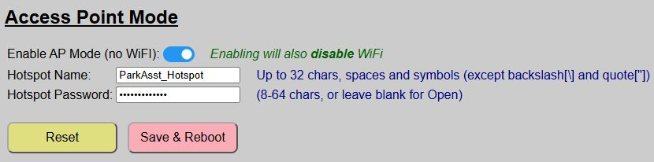
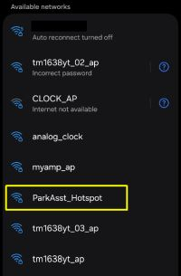
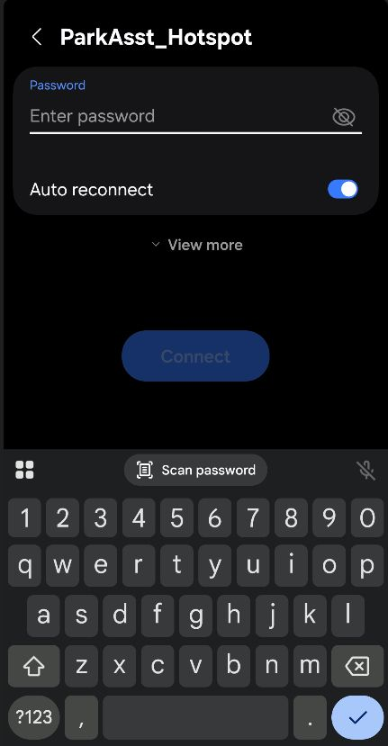
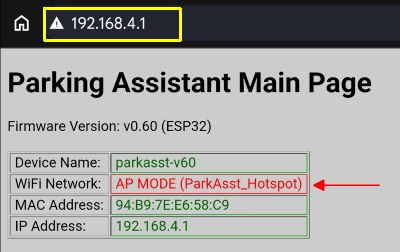
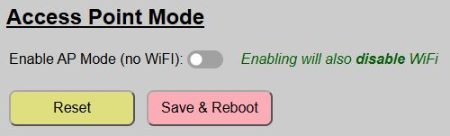

# Access Point Mode (No WiFi)
{: .no_toc }

---

  

An oft requested feature, version 0.60 of the firmware introduces the ability to enable local Access Point mode instead of using WiFi.  This is most often needed when installing the Parking Assistant in a location, such as a detached garage or outbuilding where WiFi may not be available.

Before you can enable this mode (and disable the WiFi features), a few prerequisites must be met:

### <u>System Must First Be Onboarded via WiFi</u>
The onboarding process requires WiFi.  If your planned location does not have WiFi, then simply onboard the ESP32 at a location with WiFi first.  Once onboarded, you can switch to AP Mode via the instructions on this page and then move the controller to the final location.

### <u>MQTT / Home Assistant Discovery Must be Disabled</u>
Since MQTT (and Discovery) require WiFi, you cannot switch the system to AP Mode if Discovery exists or MQTT is enabled.  You must first remove any Discovered devices (if any) and then disable MQTT before you can switch to Access Point mode.

### <u>Other Features Will Also Be Disabled or Limited</u>
Other features that rely on WiFi will also be disabled/unavailable when in AP Mode:
- Firmware Updates:  Firmware updates from within the app use WiFi to transfer the new file.
- Arduino OTA Updates:  This feature requires WiFi/mDNS, so it will also be disabled 
- HTTP API: Commands can only be sent from devices connected to the AP hotspot

## Enabling Access Point Mode
Once the above prerequisites have been met, you can toggle AP Mode from the Hardware Settings page.

  

Simply toggle the silder to disable WiFi and enable AP Mode.  If you have enabled a feature (like MQTT) that prevents AP mode, you will be shown a message and toggle will move back to "OFF" until you've disabled the other feature(s).

When toggled 'ON', two additional fields are shown:

Setting|Purpose
---|---
HotSpot Name|This is the hotspot that will be broadcast by the system when in AP Mode.  It can be up to 32 characters, numbers or symbols except for the backslash (\\) or quote (") symbols.  It cannot be blank and should not be the same as any other Parking Assistant hotspot name.
Hotspot Password|Enter a password of 8-24 characters in lenght.  Optionally (but not recommended), you can leave the hotspot 'open', which will not require a password.

>⚠️ **Password Recommended** Leaving a blank password/open hotspot may be more convenient when you need to interact with the system, but anyone else in range of the hotspot can also access the web application and interact with the system.  Even though the range of an ESP32 is rather limited, applying a password is still recommended.
{: .important}

Finally, click the 'Save and Reboot' button.  The system will reboot, but this time, WiFi will not even be started.  Instead, the system will begin broadcasting a local hotspot using the name you specified.  Otherwise, the system will function and operate identically.

## Accessing the Web Application when in AP Mode
So, if the system is not on WiFi, how do you return to the web application to interact with the system or make other changes?  Well, you use a mobile device (tablet or laptop recommended, just due to large screen real estate, but a phone will work as well) and connect to the local hotspot.

In addition, because the radio on the ESP32 isn't very powerful, you'll need to be relatively near the parking assistant to join the hotspot.

_The following instructions and screen shots may be slightly different depending upon the type and operating system of the mobile device in use. Android, iOS and Windows all work slightly different, but the steps should be similar._

Using your mobile device, search available WiFi Networks:

Join this hotspot.  If you entered a password, you will be prompted to provide it.

If prompted, elect to  'remain connected' if your device complains about no Internet.  Depending upon your device/OS, the web page may launch automatically. If it doesn't simply open a browser and enter the default IP address of: `192.168.4.1`.  

This should launch the main page of the web application. 

Note that the info block at the top of the page now indicates AP MODE for the Wifi Network and includes the hotspot name in parentheses.  Once on the main page, you can interact with the system, even changing and saving hardware settings, just like the system was on normal WiFi.  The only exception will be those previously mentioned features, like firmware updates or enabling MQTT, which are only available in normal WiFi mode.

When done interacting, simply rejoin your device to normal WiFi again.  Nothing needs to be done on the parking assistant side and it will continue broadcasting the hotspot for the next time you need to interact with the system.

## Returning to Normal WiFi Mode
If your system is in Access Point mode and you wish to return to normal WiFi mode, the process is even easier!

Access the web app with a mobile device and the hotspot as described above.  Go to the Hardware settings page and simply toggle the AP Mode switch back to the off position.

Now just 'Save and Reboot'.  The previously used WiFi credentials (SSID and password) used during initial onboarding will be recalled and the system will rejoin normal WiFi when it reboots.  Easy, peasy!  This means you can switch back and forth between normal and AP modes as needed.

## Applying Firmware Updates
One of the features that is disabled when the system is in AP Mode is the ability to update the firmware from the web application.  So how do you handle this situation if you have a system without WiFi and a firmware update is released?  You have a couple of options available.

### Option 1: Return the System to WiFi Mode (recommended method)
First place the system back in normal WiFi mode.  If Wifi is not available in the installed location, then you'll need to temporarily move the controller to a WiFi-enabled spot.  If you built your system according to the [Build Guide](https://resinchemtech.blogspot.com/2026/08/parking-assistant-2026.html) and your ESP32 is mounted on pin headers, you can simply power down the system and remove the ESP32.  Take the ESP32 to a WiFi-available location.

Power the removed ESP32 via its USB port.  Since there are no LEDs or sensors attached, pretty much any USB power source... a cell phone charger or an available USB port on a computer will work.  And since we are just using USB for power in this case (and not data), you do not even need a data cable in this case.

Once the ESP32 is back on WiFi and powered, return to the web application. Note that this may be a different IP address than previously assigned if you did not assign a static/reserved IP address when you onboarded the system.  If you cannot reach the web application, check your router to see if a different IP was assigned.

### Option 2: Update via AP Mode
Alternatively, you can download and transfer the firmware update file (`ParkingAsst_vX.XX_Update.bin`) to your mobile device (laptop strongly recommended), join the hotspot and open up the web application.  This method is not the recommended process for a couple of reasons:
- Depending upon your device, it may not be possible to select the transferred update.bin file from the file browser provided on the update page.
- Hotspot mode simply isn't as robust and reliable as normal WiFi mode.  You may have issues with a successful flash if the file transfer process is interrupted.

But you can always try this method and fall back to the WiFi method if it fails.

Regardless of the method used to access the web page, just use the Firmware Update controller command to flash the update file.  See the [Installing Firmware Updates](firmwareupdates) topic for step-by-step instructions upgrading the firmware.

If you used Method 1, simply set the system back to AP Mode after the update and then reinstall the ESP32 back into the controller assembly.  When it reboots, it will return to AP mode.

  <a href="{{ '/sensorcalibrate' | relative_url }}" class="btn btn-outline"><- Previous: Sensor Calibration</a>
  <a href="{{ '/usingmain' | relative_url }}" class="btn btn-purple">Next: Using the System -></a>

