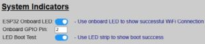
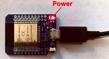
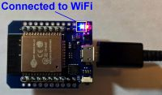
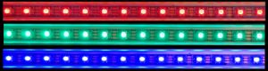

# The Boot Process
{: .no_toc }

---

  

A lot is going on in the background when a controller first boots up... connecting to WiFi, configuring the hardware, starting up the web server and API routines and connecting to an MQTT broker (if enabled).  The system can provide some basic visual indicators of this boot process and can help you determine where a problem may exist if the controller isn't functioning as intended.

## Visual Boot Indicators

When you power on the primary controller, the following steps occur:
* The system looks for a configuration file in its own storage (SPIFFS) partition. If not found, it enters 'Onboarding mode' and starts the WiFi Hotspot.  Setup halts at this point.
* The system attempts to connect to WiFi.  Again, if it fails, it enters Onboarding mode and further setup halts.
* The configuration file is opened and your particular system settings are loaded.
* Hardware and sensor(s) are configured and initialized.
* OTA Mode is enabled.
* When boot is complete, the system enters normal running mode.
  

_Note_:  You can disable some of these boot indicators via the web app if you don't want to see them.  The process described below assumes these indicators are enabled.

### WiFi Connected

Most ESP32 board have a power LED that will illuminate as soon as power is received.

But most boards also have a second onboard LED (usually blue) that can be controlled via a GPIO pin (GPIO2).  If your board has one (and the option is enabled), this second LED lights up to let you know the controller is officially talking to your network and not just glowing in the dark!

This option can be disabled if your board does not have a second LED.  Or if your board uses a different GPIO pin for the onboard LED, you can also change that via the system's hardware settings.

>📵 **Access Point (No WiFi) Mode** If your system is configured for Access Point mode, then the blue LED will never illuminate after initial onboarding, regardless of indicator setting.
{: .note}

### Side Sensor Initialization
If you have enabled and configured a side sensor (lateral guidance), the boot process will initialize the communication with the sensor.  If this initialization **FAILS**, then the LED strip briefly flashes orange. 

If the side sensor successfully initializes (or if it is disabled), then you will not see this brief orange color.

### LEDs and Other Hardware
If all other hardware and boot processes complete, and if enabled, the LEDs will then briefly flash red, green and blue.

Once you see this sequence, all hardware and other communication protocols have been initialized and started.  There is just one more step before the system begins normal operation.

### OTA (Over-the-Air) Updates Enabled

Finally, if all other checks complete, the boot process enables over-the-air mode for receiving firmware or other updates wirelessly.

When OTA mode is implemented, the LEDs change to alternating red and green.  During the boot process, this is only shown for a few seconds and _does not indicate that the system is receiving data_.  During the boot, it only indicates that OTA is now active and available.  Note that this indicator will always be shown, even if the LED Boot Indicator option is disabled in the hardware settings.

**NOTE**: OTA requires WiFi, so if you are operating in Access Point (no WiFi) mode, the OTA will not be enabled and the LEDs will not show this mode.

After this final step, the system enters normal operating mode.

>👉**System Always Starts in "Parking" Mode after Rebooting** By design, any time the system boots, it will start out in 'active' mode.  If a car is present, the LEDs will light up appropriately based on position.  The LEDs will remain on for the "Park Time" until the system enters 'Standby' mode.  If no object is in any zone, then the system will enter standby after the "Exit Time".
{: .note}

>⚠️**Additional Startup Processes** If you have MQTT enabled, there may be up to a 30 second delay as initial MQTT topics are published before the system will respond to sensor triggers. If the system doesn't respond immediately after booting, give it 30-60 seconds to complete all start up processes.
{: .important}

  <a href="{{ '/onboarding' | relative_url }}" class="btn btn-outline"><- Previous: Onboarding</a>
  <a href="{{ '/setupmain' | relative_url }}" class="btn btn-purple">Next: Initial System Setup -></a>

