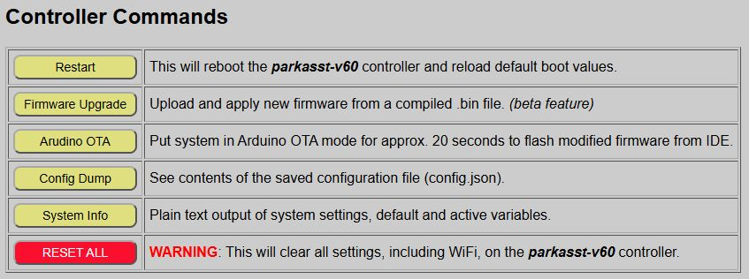
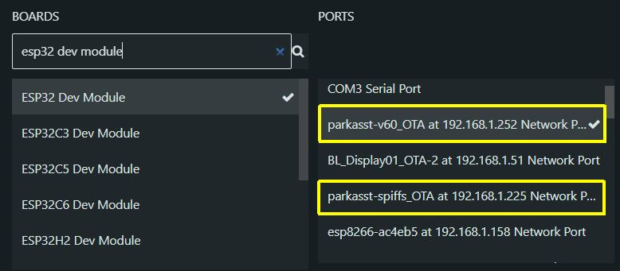
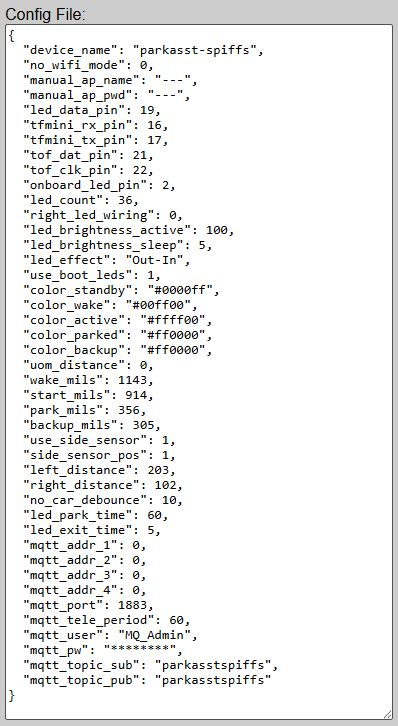
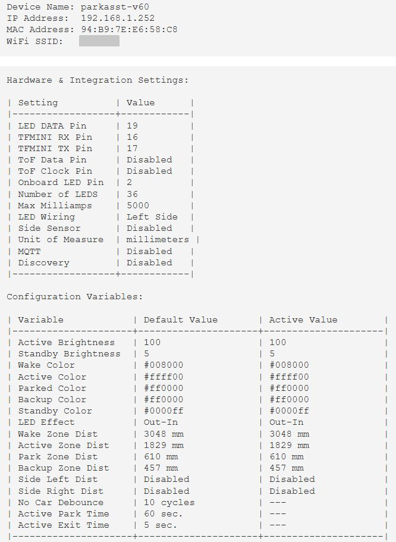

# Controller Commands
{: .no_toc }

---

  

The main page of the web application offers a set of standard controller commands that can perform operations such as rebooting the controller, applying firmware updates, viewing the contents of your saved configuration file or even factory resetting the controller for a new onboarding process.  

### Restart

 Reboots the controller. If you have applied any "Active" settings that have not been saved as new defaults, these settings will be overwritten with the last saved defaults during the reboot.

### Firmware Upgrade

This opens up a page for applying firmware updates from a compiled `_Update.bin` file, normally from the repository's Releases page.  You cannot upgrade using the source (.ino) files, but only with a compiled .bin file.

> **⚠️ Warning** Installing the wrong firmware file on the controller will break your system. See [Installing Updates]({{ '/firmwareupdates' | relative_url }}) before proceeding.
{: .warning }

Installing firmware updates are covered in a separate upcoming topic or you can use the link in the box above to jump directly there now.

### Arduino OTA
This can be used to place the system in a special programming mode, where a modified source code version of the firmware is compiled and installed wirelessly to the controller.  Each controller broadcasts a special message that is used as a "port" in the Arduino IDE.

The port will show the device name followed by _OTA and the IP address of the controller.  Make sure when using this method that you are flashing the correct code to the correct controller.  As you can see in the above example, I have two Parking Assistants active on the network.  I can differentiate them not only by the IP address, but also by the device name I assigned during onboarding.

> **🌐 Port Not Found** The Arduino OTA process requires that your network support and allow mDNS broadcasts.  This in an Arduino requirement and not a firmware issue.  If you cannot or prefer not to allow mDNS broadcasts, then any Arduino updates cannot be done wirelessly and you will need to use a USB cable connection for uploads.
{: .note }

Once your new code is verified and ready for upload, click the 'Arduino OTA' button.  When activated, the LEDs will display an alternating Red-Green pattern

- As soon as the system is put into OTA mode, begin the upload from the Arduino IDE.
- If no code is received within about 20 seconds, the controller exits OTA mode and returns to normal operation.
- When in OTA mode, all other functions of the system are paused.  This includes:
  - No sensor triggers will be recognized.
  - No outbound MQTT updates are published (if enabled)
  - No external commands are recognized or processed

If the Arduino upload is successful, the controller will automatically reboot and begin executing your modified firmware.

Note that the Arduino OTA update is generally used when making your own modifications to the firmware.  If you are just looking to install an update or upgrade from the repository, it is recommended that you use the provided Firmware Upgrade feature described above.  See the topic [Modifying the Firmware](modifications) for more information on making your own changes to the firmware.

### Config Dump

You can use the config dump feature to get a JSON output of the contents of your saved configuration file.

 
<i>Example configuration file. Fields will differ based on settings/options selected</i>
  
This can be handy for troubleshooting and you may also be asked for the contents of this file if you open an issue related to the firmware in the Github repository.  You can simply copy/paste the prettified JSON output from the web page to the Github issue (or Discussions).
  
👉<i> Note that distances are always stored in millimeters in the configuration file, regardless of units selected.</i>
  
> **👁️ Home Assistant Discovery Config** If you have enabled Home Assistant Discovery, the config dump from the primary controller will also include a second configuration file for the Discovery process.  If Discovery is not enabled, this just includes a message to that effect.  See the [Home Assistant Discovery](discoverymain)  topic for more information.
{: .note }

### System Info

This is the only controller command that is unique to the primary controller and is not available on wireless sensor controllers.

The system info is more or less an expanded version of the config dump, presented as plain text.

This contains much of the same information as the Config Dump, but in addition to saved default values, it also shows the current system's ACTIVE values.  This can also be a handy troubleshooting tool if the system isn't behaving as expected.

### Reset All

This performs a "factory reset" on the controller, wiping out all saved configuration data.

> **❗ HIGH RISK** This command wipes **ALL** configuration data from the controller, including saved Wi-Fi credentials. Use this only if you intend to return the controller to its original installation state. You will have to repeat the [Onboarding]({{ '/onboarding' | relative_url }}) and [System Setup]({{ '/setupmain' | relative_url }}) processes.
{: .warning }

### External Control
Some of these commands can also be sent via MQTT or via the HTTP API.  See [Using MQTT and the API]({{ '/integrationmain' | relative_url }}) for a list of applicable commands.

## Next Steps
This completes the normal setup and operation of the system.  The remaining sections of the guide cover optional features like MQTT or Home Assistant integration, upgrading or modifying the firmware, advanced technical information and a troubleshooting section.

  <a href="{{ '/sensoroverride' | relative_url }}" class="btn btn-outline"><- Previous: Overriding the Sensors</a>
  <a href="{{ '/integrationmain' | relative_url }}" class="btn btn-purple">Next: Optional Integrations -></a>

