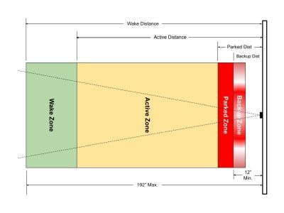
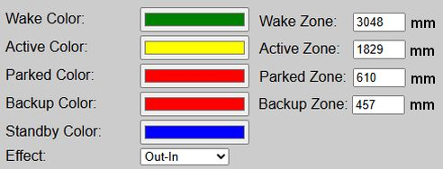
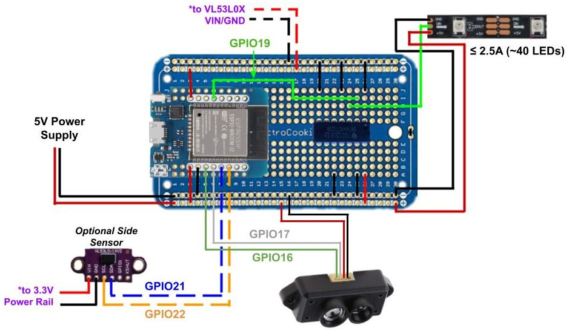
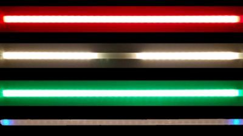
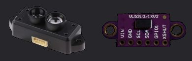
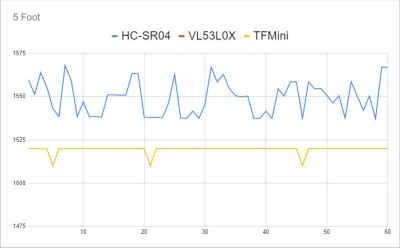

# Concepts and Terminology
{: .no_toc }

To successfully install and configure this firmware, it is important to understand the underlying system design and the specific terminology used throughout this documentation.

**🌐 Connectivity & Privacy:** This system is designed to be **fully functional on a local Wi-Fi network**. While it supports integrations like Home Assistant or other systems via MQTT/API, these are strictly **optional**. An active internet connection is not required for core operations.  There is even a mode where the system can operate without WiFi (Access Point mode).
{: .note }

---

## Parking Zones

  &emsp;

To properly configure your system, it is important to understand the different ["zones"](zones) and how they are used.  As a car enters each zone, the LEDs will change color.  What's more, when the car is in the 'Active' zone, an LED effect is used to show the approach to the 'Parked' zone.  Distances, to the outer edge of each zone, can be entered in inches or millimeters.

## The Primary Controller

  

The primary controller consists of a standard ESP32 (WROOM-32) and a _recommended_ logic level shifter.  If you've ever built your own WLED controller, the base is nearly identical.  See the [build guide](https://resinchemtech.blogspot.com/2026/08/parking-assistant-2026.html) for complete wiring diagrams and step-by-step assembly instructions.

## LEDs

  

The system is designed to only work with 5V WS2812b LED strips.  Use of other 5V LED types will require modification of the source code and your own complied version.  Use of 12V or 24V are not supported, as generally these can only control the LEDs in groups of three or six, respectively.  This system needs to control each LED individually, which is normally only found when using 5V addressable LED strips.

The system can theoretically support up to 600 LEDs.  But to minimize the power required (and therefore the wiring), a strip of around 2 feet long is recommended.  This will be around 25 standard LEDs when using a common 60 LEDs/m version.  Alternatively, and to provide greater sensitivity, you can substitute a WS2812b COB LED strip.  Using a version of 160 LEDs/m allows around 100 LEDs in the same 2 foot width, while also drawing about the same amount of current (give or take a bit).

Ideally, you want to keep the current amp draw of the LEDs to around 2.5A or lower when fully lit at expected brightness.  Exceeding this value will require different power routing (e.g. extra power lines directly to the LEDs). Again, refer to the [build guide](https://resinchemtech.blogspot.com/2026/08/parking-assistant-2026.html) for more information on the LED strips, power supplies and wiring.

## Sensor(s)

  

### Primary (Front) Sensor

The primary, or front sensor that tracks the car through the zones, is a TFMini-s LiDAR distance sensor.  The first thing you'll notice about this sensor is its cost... approximately $40!  This is substantially higher than many other distance sensors, like the ultrasonic HC-SR04, that can be purchased for under $5.  

However, in the [original parking video](https://youtu.be/HqqlY4_3kQ8), I compared various sensors at different distances and charted the results.  

  

The TFMini-s was the only sensor with the range, precision and signal stability to meet my needs.  Personally, saving $30 isn't much comfort when signal jitter from a noisy subpar sensor causes a bumper to take a $500 bite out of the drywall. 😭

One important note.  Be sure to purchase a TFMini-s (the -s is important).  Other models of the TFMini, such as the _TFMini-plus_ or _TFMini-luna_ use different communication protocols and will not work with the current firmware.

**⚠️ Alternate Sensor Requests:** I've received multiple requests to release a version using a cheaper sensor, like the HC-SR04.  But saving $30 dollars isn't worth the risk of damaging the car or wall by using a less-capable version.  Some have forked the project to substitute a cheaper sensor, but I cannot attest to their functionality nor can I support them.  If you wish to try a different sensor, please understand that you will need to modify the firmware and are on your own for support!
{: .important }

### Optional Secondary (Side) Sensor

While not required, you can add a side sensor to the system to provide both lateral guidance and to improve the front sensor accuracy.  But in this case, and because the side sensor needs neither the range nor the precision of the front sensor, this does use a much lower cost VL53L0X sensor.  However, just like the front sensor, the firmware is written for this particular component.  Substitutions will likely require firmware modification.

## Other Important Terminology
There are a few other important terms to understand... at least as far as this guide is concerned.

### Firmware 
This is the compiled code that gets installed on the ESP32 controller.  For this project, the firmware is delivered as a .bin file included in a release's assets.  Note that you cannot directly install the source code (.ino) directly on an ESP board.  It must be compiled into a binary .bin file using the Arduino IDE, PlatformIO or other compiler.  This project includes separate firmware for installing on a new controller or for upgrading an existing controller (v0.60 or greater).

### Web Application:
 The firmware contains an embedded web server and web application. These are primarily used to configure and setup the controller, but can also be used to test or change LED colors, approach effects and distances.

When this documentation refers to the "web app", it does not mean a separate application that has to be installed on a computer, phone or tablet.  You can always access the firmware's "web app" by just going to the IP address of the controller in a web browser of any device on the same WiFi network.  If you opt to run the system in "No WiFi" mode, then the controller will broadcast a local hotspot you can join to access the web application and make system changes.

  <a href="{{ '/about' | relative_url }}" class="btn btn-outline"><- Previous: About the Project</a>
  <a href="{{ '/startingmain' | relative_url }}" class="btn btn-purple">Next: Getting Started -></a>

