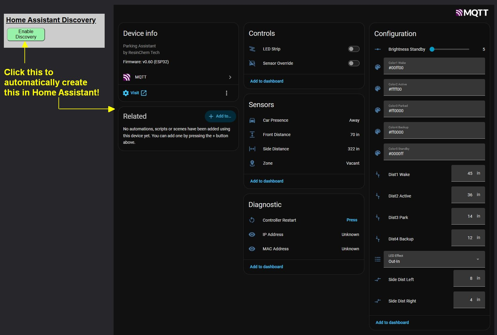
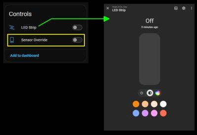
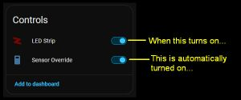
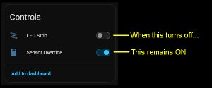
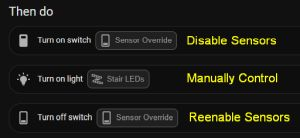

# Home Assistant Discovery
{: .no_toc }

---

<p align="center">
  
</p>

If you are a Home Assistant user, you can integrate your LED controller to use its features directly from your dashboards or utilize them in complex automations and scripts. The system offers over 20 distinct entities—including a light, sensor states and settings, and other miscellaneous values without requiring any manual YAML configuration on the Home Assistant side.  And you have control over which entity groups are included and which are omitted!
<p align="center">
  
</p>

## Prerequisites
Before attempting to enable Discovery, ensure your environment meets the following requirements:

1. **Home Assistant:** Version 2026.3 or later is recommended.
2. **MQTT Broker:** A properly configured broker must be available on your network (e.g., the official Home Assistant Mosquitto add-on or a standalone broker).
3. **MQTT Enabled:** You must have successfully [Enabled and Configured MQTT]({{ '/mqtt' | relative_url }}) in the Parking Assistant’s Integration settings and verified the connection.

---

## Understanding Discovery Naming
The Discovery process creates a new "Device" in Home Assistant using the **Discovery Device Name** you specify. This name is critical because it determines how your entities appear in the Home Assistant database.

### Entity ID Generation
All created entity names are prepended with the device name. The system automatically converts the name to lowercase and replaces spaces with underscores.

**Example: Device Name "ParkAsst 1"**
* `light.parkasst_1_led_strip`
* `sensor.parkasst_1_parkdistance`
* `text.parkasst_1_effect`

> **💡 Note**<br>Once Discovery is enabled, the **device name** cannot be changed without first removing the Discovery and re-adding it. Consider your naming choice carefully to avoid breaking future dashboards or automations.
{: .note }

---

## How Discovered Entities Work In Home Assistant
When the LED strip is created in Home Assistant, it is created as a "Light" entity.  As a light entity, it has its own color and effect attributes.



Note that these are separate and independent from any effect and colors set for the zones.  This means that the LED strip light attributes are only used when manually controlling the LED strip.  However, to manually control the strip and not have any changes immediately reset by the sensor settings, the sensors must be disabled or overridden.



Since manually controlling the LED strip requires that the sensor override be ON, the system will set this automatically any time you perform an action that causes the LED to turn on.  This is true whether using the Light Card or an automation.  

<i><b>Note:</b></i> While turning on the light via the entity also automatically enables the override, you can also manually enable the override without actually turning on the LEDs.  This can be done if you simply wish to override the sensors and not have the system react to triggers.

So while the override gets automatically set when manually turning on the LEDs, the <b>opposite is not true!</b>



This is intentional because you may wish to maintain manual control of the LEDs even after they are toggled off.  However, you must remember to disable the sensor override to return the system to automatic operation where it again responds to sensor triggers.

### Automation Recommendations
If controlling the LEDs via automations or scripts, it is recommended that you explicitly disable and re-enable the sensor override.

<i>Using the UI editor:</i><br><br>


<i>Using YAML:</i>
```yaml
actions:
  - action: switch.turn_on
    target:
      entity_id: switch.parkasst_sensor_override
  - action: light.turn_on
    target:
      entity_id: light.parkasst_led_strip
  - action: switch.turn_off
    target:
      entity_id: switch.parkasst_sensor_override

```

Since turning on the LED strip also automatically enables the sensor override, the first action is technically unnecessary.  But it is recommended since enabling the sensor override also clears any active sensor triggers and sets the LEDs to an off state.

The last action, reenabling the sensors, also does not need to appear in the same automation's actions if you wish to leave the LEDs in a manual state after the automation completes.  Just remember to disable the override to return the system to automatic operation.

> **🚩 System not responding?**<br>As covered under [Troubleshooting](troubleshooting), if you have your controller integrated with an external system and the LEDs no longer seem to respond to the sensors, check that the Sensor Override setting has not been left on.
{: .important }

## In This Section

* **[Enabling and Disabling Discovery]({{ '/discoverymanage' | relative_url }})** – Step-by-step instructions for the initial setup and removal of the HA integration.
* **[Editing or Hiding Discovered Entities]({{ '/discoveryentities' | relative_url }})** – Managing entity groups and a complete reference table of all discovered entities.
* **[Manually Creating MQTT Entities]({{ '/discoverymanual' | relative_url }})** – Advanced instructions for users who prefer manual YAML configuration.

---

<div style="display: flex; justify-content: space-between; align-items: center; margin-top: 40px; border-top: 1px solid #333; padding-top: 20px;">
  <a href="{{ '/api' | relative_url }}" class="btn btn-outline"><- Previous: API HTTP Command List</a>
  <a href="{{ '/discoverymanage' | relative_url }}" class="btn btn-purple">Next: Enabling and Disabling Discovery -></a>
</div>