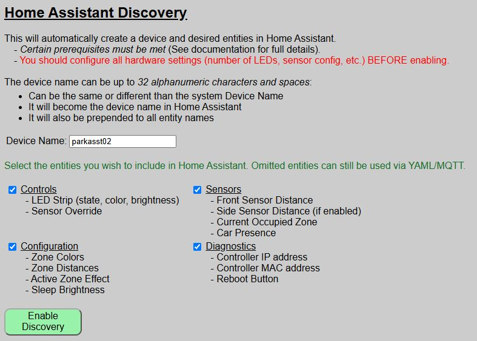
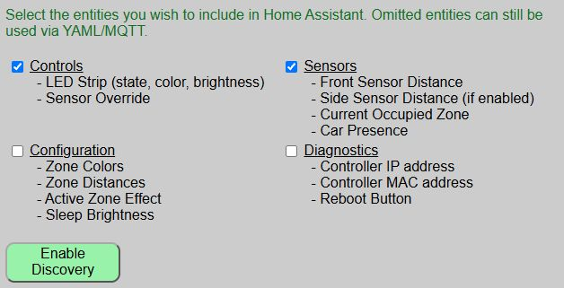
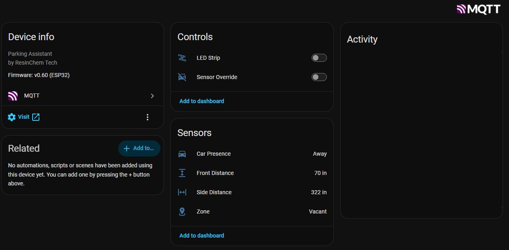
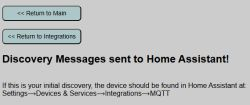
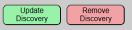

# Enabling and Disabling Discovery
{: .no_toc }

---

  

Once your MQTT broker is verified and your Device Name is chosen, you are ready to initiate the Discovery process. This establishes the initial link between your Parking Assistant and Home Assistant.

---

## Accessing the Discovery Menu
The Discovery settings are located within the **Integrations** menu of the primary controller.  This is the same page where MQTT settings are entered.

1. From the main web application, click the **Integrations** button.
2. As per the previous requirements, you should have already enabled MQTT at the top of the page. 
3. Scroll down to the section **Home Assistant Discovery**.

&emsp;&emsp;

## Enabling Discovery
Before clicking the enable button, confirm your configuration:

* **Device Name:** Ensure the name is 1-32 characters and correctly formatted (alphanumeric and spaces only).
   * Name <b>must</b> be unique from any other discovered devices in Home Assistant.  This includes any other Parking Assistants.
   * You can use the same device name you assigned during onboarding, or a completely different device name. 
   * Recall that the device name will be assigned to the created device in Home Assistant _and_ will be prepended to all entity names.  This is a Home Assistant _"feature"_ and not a function of the firmware.
* **Entity Groups:** Check the boxes for the groups you wish to export to Home Assistant. You can always add more later.
> **💡 Entity Group Selection** It is not required that all entity groups be selected.  You can choose which entity groups you want included in the Home Assistant device.
{: .note }

&emsp;&emsp;

If the above selections are made, then in Home Assistant just the entities related to the LED Strip, Sensor Override and Sensor States will be created.

### The Enablement Process
Click the **ENABLE DISCOVERY** button. You will be prompted with a final confirmation dialog. 

> **💡 Instant Integration** There is no prompt or "accept" button within Home Assistant itself. As soon as you confirm in the web app, the device is broadcast to the broker and Home Assistant will immediately add the new device and entities.
{: .note }

Once confirmed, you can navigate to the **Devices & Services** section in Home Assistant to verify the "Parking Assistant" (or your custom name) is listed.

---

## Removing or Disabling Discovery
If you need to completely remove the Parking Assistant from your Home Assistant environment, do not simply delete it from the HA dashboard.

> **⚠️ Proper Removal Procedure** If you simply delete the device directly within Home Assistant, it may spontaneously reappear the next time the Parking Assistant or the HA server restarts. To permanently remove the integration, use the **REMOVE DISCOVERY** button on the web app's Discovery page.
{: .warning }

Clicking **REMOVE DISCOVERY** sends a "clearance" message to the MQTT broker, ensuring all discovery topics are purged and the device is cleanly unlinked from Home Assistant.  If you end up with orphaned entities or ones that continue to reappear in Home Assistant, see the [Troublshooting](troubleshooting) topics.

  <a href="{{ '/discoverymain' | relative_url }}" class="btn btn-outline"><- Previous: Home Assistant Discovery</a>
  <a href="{{ '/discoveryentities' | relative_url }}" class="btn btn-purple">Next: Updating or Hiding Discovered Entities -></a>

