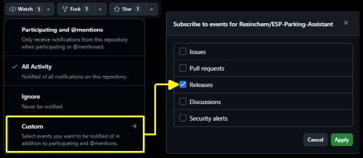
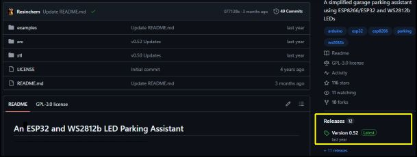
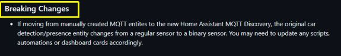
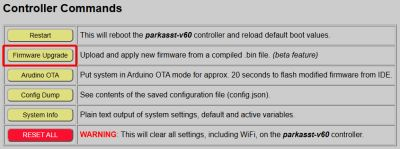
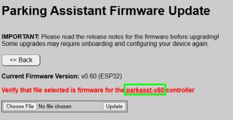
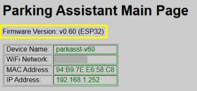

# Installing Firmware Updates
{: .no_toc }

---

  

From time to time, new versions of the firmware are released to provide bug fixes, new features, or support for updated hardware. This section covers how to obtain the latest files and apply them safely to your system.

>⚠️ **Special Note for Users Current on version 0.52 or Lower!** A "migration" to a new partition layout was first introduced beginning with version 0.60.  To upgrade from v0.52 or earlier to v0.60+, you should complete a [One Time Migration](migration) of your system.
{: .important}

## Update Notifications
Since the system is designed for local privacy and operates without a constant internet "phone home" connection, there is no automatic push notification for updates within the web app.

To stay informed, it is recommended to "Watch" the official repository:
1. Log into your GitHub account.
2. Navigate to the [ESP Parking Assistant](https://github.com/Resinchem/ESP-Parking-Assistant) repository.
3. Set a **Watch** notification for "Releases."

&emsp;&emsp;

Assure you have enable notifcations in your Github settings and you can receive an email or a push notification in Github whenever a new release is published.

## Obtaining the Latest Firmware
The most recent stable files are always located in the **Releases** section of the GitHub repository.

### Release Notes
Each release includes notes detailing exactly what changed. Read these notes carefully so you fully understand how an update may impact your current system and setup.

> **❗ Pay Attention to Breaking Changes** Always check the release notes for a **BREAKING CHANGES** section. These may require you to perform extra configuration steps or hardware adjustments during the upgrade process.
{: .important }

_Example of a Breaking Changes section in release notes:_ 

### Which file do I need?
If you are running the standard, unmodified firmware, you only need the `_Update.bin` files under the release's assets:
* **Example Update File:** `ParkingAsst_vX.XX_Update.bin`

*(X.XX represents the version number)*

> **💡 Full vs. Update Files** Each release contains TWO .bin files under the assets.  In addition to the `_Update.bin`, the assets will also contain a `_Full.bin` version.  The "Full" version is meant for new installs only.  If you install the "Full" version onto an existing controller, all your configuration settings (including WiFi credentials) will be overwritten and you will have to onboard and configure your controller again.  
{: .note }

_You do not need the Source code files unless you are looking to modify the firmware_.

## Installing the Update

1. Navigate to the **Controller Commands** section of the controller you wish to upgrade.
2. Click the **Firmware Upgrade** button.

&emsp;&emsp;

3. On the upgrade page, if you have more than one system, verify the **Device Name** to ensure you are on the correct system's page.  

&nbsp;&nbsp;&nbsp;&nbsp;&nbsp;&nbsp;&nbsp;&nbsp;&nbsp;&nbsp;&nbsp;

4. Click **Choose File** and select the `_Update.bin` file you downloaded.

5. Click **UPDATE**. 

A progress bar will appear. Once the upload reaches 100%, the controller will automatically reboot.

>**⚠️ Caution** Once the flashing progress bar begins, keep your grubby little mitts to yourself! Pulling power or otherwise disrupting the system mid-flash is a quick route to turning a $4 microcontroller into a paperweight, and no amount of Vulcan mind melds will recover it without a full wired re-flash.
{: .important }

## Verifying the Update
Once the system reboots, navigate to the top of the controller's main page. The version string in the header should now reflect the updated version number.

If the old version number is still displayed, the update failed and the system successfully "rolled back" to the previous firmware. You can attempt the flash again or consult the [Troubleshooting](troubleshooting) topic. 

## Using Third-Party Utilities
While the internal web update is the recommended path, utilities like [ESPConnect](https://thelastoutpostworkshop.github.io/ESPConnect/) can be used as a fallback.

> **⚠️ Critical: Partition Layouts** Due to the complexity of the firmware, this project uses non-standard partition sizes. 
> * **DO NOT** select "Erase Flash" before flashing; this will wipe your configuration files and Wi-Fi credentials.
> * Your utility **must** support custom partition offsets. Failure to respect the partition layout will result in a boot failure.  See [Advanced](advanced) topics for information on required partitions.
{: .warning }

## Updating Modified Firmware
If you have customized the C++, HTML, or CSS, applying an official `.bin` update **will overwrite all your changes.** You must instead pull the updated source code from GitHub and re-apply your modifications manually before compiling.

  <a href="{{ '/firmwaremain' | relative_url }}" class="btn btn-outline"><- Previous: Firmware Updates</a>
  <a href="{{ '/migration' | relative_url }}" class="btn btn-purple">Next: v0.5x Migration Guide -></a>

