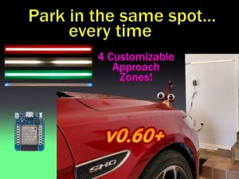

# Welcome to ESP Parking Assistant
{: .no_toc }

---

  

This site contains information regarding the installation, configuration and use of the firmware for this project. This includes the installation, onboarding, configuration and general use of the embedded web application. 

> **🤖 AI Transparency Statement** The provided firmware and documentation were created and developed by me (**a certified carbon-based life form**).  While Gemini AI was consulted for some of the more complex logic, _no code was blindly copied and pasted without detailed review_ by an entity whose operating system runs on coffee rather then 5V DC.  All documentation, while proofread by Gemini, was also written by this same biological unit, capable of passing a Voight-Kampff test on the first try!
{: .note }

<b>This documentation site only applies to version 0.60 and later of the firmware</b>, as this is a completely different firmware structure compared to the older versions.  If you are looking for documentation for versions prior to v0.60, please see the original project's [Github Wiki](https://github.com/Resinchem/ESP-Parking-Assistant/wiki).

> **⚠️ Build Instruction Notice**  This documentation **does not** contain build instructions, parts lists, or wiring diagrams. For the physical build details, please refer to the following resources:
> * **YouTube Overview: [{{site.substitutions.youtube_title}}]({{site.links.youtube_video}})**
> * **Written guide (parts list, wiring diagrams, etc.): [{{site.substitutions.blog_title}}]({{site.links.blog_guide}})**
{: .important }

### How this document is organized
The documentation follows a logical setup flow, grouped into the sections seen in the sidebar:
1.  **Welcome:** About the project, concepts and terminology.  
2.  **Getting Started:** Initial firmware flashing, onboarding and interface setup.
3.  **Setting Up the System:** Web app overview and setting various system options.
4.  **General System Use:** General operation of the system

The remaining topics cover optional and more advanced options, along with a troubleshooting section.

**If you are setting up your system for the first time, begin with the [Getting Started](startingmain) section.**

### Sensor Information

As covered in various related documents, the system can be built as a single-sensor system for front guidance only or you can optionally include a secondary side sensor to provide lateral (left/right) guidance as well.  

If you are only using a front sensor (TFMini-s) for your project, just ignore or skip any information that relates to the side sensor as it will not be applicable for your build.

### Hardware Substitutions

The firmware has been written and tested for a specific set of hardware. If you decide to swap the TFMini-s for an HC-SR04, congratulations! You’ve just been promoted to Lead Engineer of your own custom fork.

>🛠️ **Please Note** While I admire the DIY spirit, I simply don’t have the bandwidth to maintain multiple versions of the firmware beyond the options provided. If you venture off-book, you are the Captain of that ship — I’ll be on the shore cheering you on, but I can't help you navigate the "Why are my LEDs the wrong color?" phase of the journey.
{: .important }

*If you use different hardware, you will need to fork this repository and modify the code yourself. See the [**Modifying the Firmware**](modifications) section for more info.*

### Opening Issues
* **Issues:** Reserved strictly for firmware errors or bugs.
* **Discussions:** For enhancement requests, "how-to" questions or problems that aren't firmware related.

**Issues opened for feature requests or alternate hardware will be closed without response.**
{: .label .label-yellow }

   <a href="{{ '/about' | relative_url }}" class="btn btn-purple">Next: About the Project -></a>

