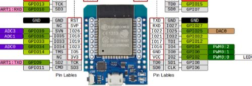
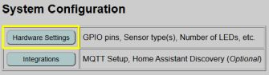
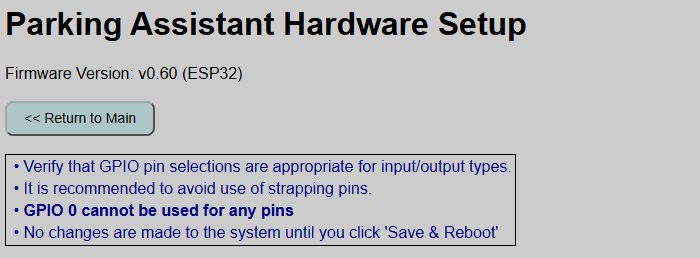
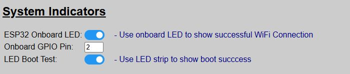
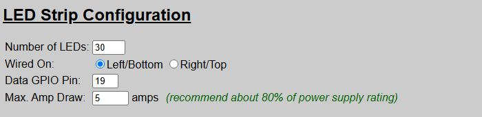
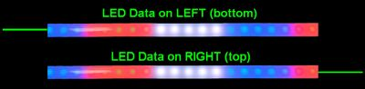
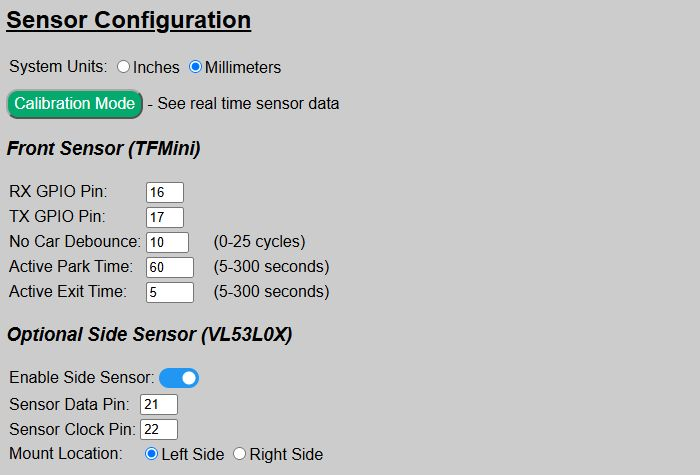
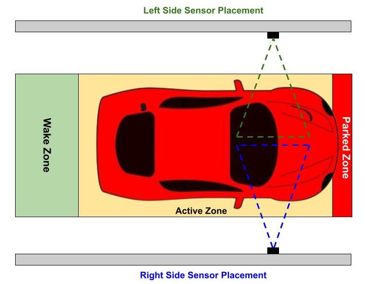

# Hardware Configuration
{: .no_toc }

---

  

After initial onboarding, you may find that the system doesn't operate or isn't behaving as intended.  This is due to default hardware values that are used for the installation.  To make the system fully functional, you **must** configure your particular hardware.

>👉 **GPIO Pins** The system allows you to use different GPIO pins for your devices other than the defaults provided with the firmware.  But note that you cannot use GPIO 0 for any of your settings.  While GPIO 0 is a valid GPIO pin on most ESP32s, within the context of this application, using "0" as a GPIO pin means that device is not used.  Do not set any GPIO pins to "0" unless you truly are not using that device/connection.  Use of strapping pins is also discouraged, but not enforced by the application.
{: .note }

Begin by opening the integrated web app by just going to the IP address of the controller in a web browser of any machine on the same network.

Near the top of the main page, you will see a System Configuration section with a Hardware Settings button:  
  

The top of the hardware settings page shows the current version number, a navigation button back to the main page and a few reminders.  Various settings are listed underneath. I'll show and describe each section separately, starting from the top.

> **⚠️ IMPORTANT** Changes made on this page are not committed and applied until you click the 'Save and Reboot' button at the bottom of the page.  If you make changes and then navigate to a different page before saving, all changes will be lost!
{: .important } 

## System Indicators

These were covered under the [Boot Process](booting) section, but these enable or disable the use of the LEDs to indicate boot progress and success.  

For all settings, the system default value after initial flashing is shown.

Setting|Default|Purpose
---|:---:|---
ESP32 Onboard LED|ON|Shows successful WiFi connection. Will remain off if operating in Access Point Mode (no WiFi).  Otherwise remains on after connection is made.
Onboard GPIO Pin|2|For most ESP32 boards, the onboard LED is controlled by GPIO2.  Only change this if your board is different.  Ignored if prior setting is disabled.
LED Boot Test|ON|Briefly flashes the LEDs red, green and blue at the end of the boot sequence to indicate a successful boot.

I generally recommend that you leave these options enabled.  The only exception might be the ESP32 Onboard LED.  Once you've established that WiFi regularly connects, you may wish to toggle this off just as the blue LED can be quite bright.

## LED Strip Configuration

This is where you configure your LED strip.  Initially, you may notice that not all LEDs light up, or effects aren't rendered properly.  This is likely because the initial default value for the total number of LEDs (30) is different than the actual number of LEDs in your strip.

Setting|Default|Purpose
---|:---:|---
Number of LEDs|30|The total number of LEDs in your strip.
Wired On|Left|Indicates where your LED data signal wire is connected to the left or right of the LED strip. This impacts how effects are rendered. See below for additional information
Data GPIO Pin|19|The ESP32's GPIO pin used to send the LED data.  Only change if you wired your controller differently.
Max Amp Draw|5|You should set this to approximately 80% or less of your power supply's peak max amp rating.  See below for discussion on this topic.

### <u>Left/Right Wiring</u>
 
To properly render the approach zone effect and to correctly flash the proper end of the LEDs when a side sensor/lateral guidance is enabled, the system needs to know whether the LED data line is connected to the left or right side of the LED strip.

If your strip is mounted vertically, select 'Left' for bottom wiring and 'Right' for top wiring.  If the approach zone effect seems to be working in reverse from what is expected, double-check this setting.

### <u>Max Amp Draw</u>
 
LEDs can draw a lot of current!  As an extra safety precaution, this setting attempts to limit the amount of amps that the LEDs will use.  It does this by limiting the overall brightness of the LEDs.

It is recommended that you set this value to no more than approximately 80% of the peak max rating of your power source.  For example, if using a 3A power supply, set this value to around 2.4 amps.  

> **⚠️ DON'T OVERTAX YOUR SYSTEM!** Setting a current limit prevents your LEDs from attempting to pull 1.21 gigawatts through a 28-gauge breadboard jumper! You're building a garage parking assistant, not a flux capacitor—cap the current draw at ~80% of your power supply's peak rating.
{: .important}

If you find that the limiter is making the LEDs too dim, even at the highest brightness, it is an indication that your power supply is too small.  See information in the [Build Guide](https://resinchemtech.blogspot.com/2026/08/parking-assistant-2026.html) for more information on selecting the proper power supply size (and special wiring that is required for high current draw systems).

## Sensor Configuration
This is where you configure the front sensor, and optionally enable and configure a side sensor for lateral guidance.

Setting|Default|Purpose
---|:---:|---
System Units|mm|Sets whether the system uses inches or millimeters for configuring zone distances.  If MQTT is enabled, also sets the distances reported from the sensors to inches or millimeters.  If you already have distances defined and change this setting, current values are converted for you.
Calibration Mode|--|Opens a separate page for obtaining raw readings from the sensor(s). See the following section on [Sensor Calibration](sensorcalibrate) for additional information.

### Front Sensor

Setting|Default|Purpose
---|:---:|---
RX Pin|16|The GPIO pin connected to the TFMini's receive or RX pin.
TX Pin|17|The GPIO pin connected to the TFMini's transmit or TX pin.
No Car Debounce|10|Number of cycles that a trigger must continue to activate the system.  See the discussion below.
Active Park Time|60|Time in seconds, that the system remains active once the vehicle enters a zone and before the system returns to standby/sleep mode.
Active Exit Time|5|Time in seconds that the system remains active once triggered and when no objects are detected in any zone.  See discussion below.

<b><u>No Car Debounce</u></b> 
The system samples the sensor distance thousands of times a second.  Occasionally, interference my cause the sensor to very briefly report a random distance.  If this distance is within one of the zone distances, this could activate the system.  To accommodate these momentary signals, a debounce setting is used to say that the distance must be within a trigger distance for so many "cycles".  As a general rule, you want this number to be as low as possible but still not randomly triggering the system.  Start with the default value of '10' and only increase by small amounts (like 5 cycles at a time) if you find the system "ghosting" and turning on when nothing is moving within the zones.

<b><u>Active Park/Exit Times</u></b> 
To understand the parking and exit times, it is important to understand how the zones work.  See the next section on [How the Parking Zones Work](zones) for more information on determining how the Park and Exit times work.  But in brief:

_Active Park Time_: Time, in seconds, that the system remains active during a parking operation before returning to Standby mode.

_Active Exit Time_: Time, in seconds, that the system remains active after all zones have been vacated.  Does not apply to a departing car and generally is only used when another object (like a person) temporarily enters and then quick exits a zone.

### Optional Side Sensor
If you added a side sensor to your build, enable it here.  The other fields only show when the side sensor is enabled, otherwise they are hidden.  Do not enable this option unless you have a physical VL53L0X sensor connected.

Setting|Default|Purpose|
---|:---:|---|
Enable Side Sensor|OFF|Toggle on to enable the side sensor.|
Sensor Data Pin|21|The ESP32's GPIO pin connected to the sensor's SDA/DAT pin.|
Sensor Clock Pin|22|The ESP32's GPIO pin connected to the sensor's SCL/CLK pin.|
Mount Location|Left|Indicates whether the side sensor is mounted to the left or right side of the car, from the driver's perspective.|

Side Sensor Positioning: 

**<u>Side Sensor Won't Remain Enabled</u>**
 If the side sensor is not present or it cannot be initialized during the boot process, the Side Sensor setting will automatically be set to 'Off/Disabled', regardless of the default setting.  If you find that after enabling the side sensor, it still shows as disabled after rebooting, check your side sensor and wiring.  In addition, the LED strip will briefly flash orange during the [Boot Process](booting) when the side sensor setting is enabled but the sensor fails initialization.

## Access Point Mode (no WiFI)
If you plan on installing your system in a location where WiFi is unreliable or unavailable, you can toggle the system into AP mode and disable WiFi.

>⚠️ **WiFi is required for initial onboarding** WiFi is required for the initial onboarding step.  If the final installation location does not have WiFi, then onboard the controller in a WiFi location and then toggle the AP Mode before moving to the final location.
{: .important}

When Access Point Mode is enabled (and WiFi is disabled), certain other features that require WiFi are also disabled.  These include:

- MQTT / Home Assistant Discovery
- HTTP API
- Firmware Updates
- Arduino OTA Updates

>⛔ **AP Mode cannot be activated if MQTT enabled!** If MQTT or Home Assistant Discovery were previously enabled in WiFi Mode, you will not be able to switch to AP Mode.  You must first disable MQTT/remove Discovery before AP mode can be enabled.
{: .warning}

See the dedicated topic [Access Point Mode](apmode) for more information on configuring and using the system via AP mode and without WiFi.

## Saving and Updating the Hardware Configuration
After making the necessary changes for your system, you **must** click the "Save & Reboot" button at the bottom of the page.

The 'Save' button will write the current settings to the saved configuration file.  The system will then reboot and configure the system with these new saved settings.  Once the reboot is complete, all your changes will be active.

>⚠️ **Navigating Away Will Lose Changes** If you make changes on the hardware page and then navigate to a different page (or close the browser) _before_ clicking the 'Save & Reboot' button, all changes will be lost!
{: .important}

If you have made changes but not yet saved them, you can use the 'Reset' button to restore all hardware settings back to their last saved default values.

  <a href="{{ '/webapp' | relative_url }}" class="btn btn-outline"><- Previous: Web App Overview</a>
  <a href="{{ '/zones' | relative_url }}" class="btn btn-purple">Next: Parking Zones -></a>

