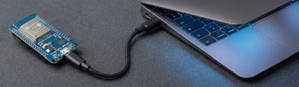
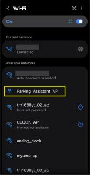

# Initial Firmware Installation
{: .no_toc }

---

  

The first step in preparing your ESP32 hardware is flashing the initial firmware onto the controller.

## 🛑 Which Path Are You On?

Before proceeding, determine which of the following three installation scenarios applies to your system:

1. **🆕 New Build / Fresh Board:** You are flashing a brand-new ESP32 or completely resetting a board. **Stay on this page and use the WebSerial flasher below.**

2. **🔄 Routine Firmware Update (v0.60 to v0.61+):** Do **NOT** use this page. Routine updates are applied wirelessly using the [Firmware Upgrade]({{ '/firmwareupdates' | relative_url }}) feature inside your running system's web interface.

3. **⚠️ Migrating from v0.52 or Earlier:** Stop here! Due to partition layout changes in v0.60+, wireless OTA updates from legacy versions are not recommended. Please follow the step-by-step **[v0.52 to v0.60 Migration Guide]({{ '/migration' | relative_url }})**.

---

## Prerequisites for New Installs

To complete the USB installation on this page, you will need:

* **Hardware:** A computer with an available USB port and a **microUSB Data Cable**. (Note: "Power-only" charging cables will not work).
* **Software:** A Chromium-based desktop browser (Google Chrome, Microsoft Edge, Brave, or Arc) version 89 or newer.
* **Firmware File:** The installer below automatically fetches the latest stable binary (`ParkingAsst_vX.XX_Full.bin`), but versions following v0.60 will allow selecting which version to install. If you prefer traditional desktop tools or want to install a version prior to v0.60, download the file from the [GitHub Releases](https://github.com/Resinchem/ESP-Parking-Assistant/releases) page.

**🖥️ Desktop Utility Alternative** If you prefer not to use a Chromium-based browser with WebSerial, you can use desktop flashing tools (like esptool or ESPHome Flasher). Refer to the [Beginner's Guide to Flashing Custom Firmware](https://youtu.be/74NGHj-cOls?t=488) video (skip to the **8:08** mark).
{: .note }

---

## 👉 Install FULL Firmware Here

**⚠️ NEW INSTALLS ONLY** - Installs the `ParkingAsst_vX.XX_Full.bin`
{: .important }

Installing the **Full** firmware image completely erases the controller's internal flash memory, wiping any saved Wi-Fi and device settings. If you are trying to update a working system (<i>running v0.60 or later</i>) without losing settings, use the embedded app's [Firmware Upgrade]({{ '/firmwareupdates' | relative_url }}) feature instead.



**🖥️ USB Drivers: The Invisible Gatekeepers** If your computer treats your ESP32 like an unrecognized device, you might be using a charge-only USB cable. Try a second known data cable before troubleshooting further.
{: .note }

**🔍 Troubleshooting COM Ports** If no new COM port appears when plugging in your board (and you are using a verified data cable), you may need to install the **CP2102** or **CH340** USB-to-Serial drivers for your specific ESP32 board.
{: .note }

---

## Success Criteria & Hotspot Verification

Once flashing completes:

1. Unplug and reconnect the USB cable to power cycle the ESP32.
2. Wait 10–15 seconds for the controller to initialize.
3. Scan for available Wi-Fi networks on your phone or computer.

**Success Criteria:** If you see a Wi-Fi hotspot named `Parking_Assistant_AP` (or `DeviceName_AP` if re-flashing a previously named controller), the firmware flash was successful!

---

### Next Steps

Now that your primary controller is flashed and broadcasting its setup hotspot, you are ready to connect it to your local Wi-Fi network and complete device onboarding.

Proceed to **[Onboarding and First Time Setup]({{ '/onboarding' | relative_url }})**.

> **⚠️ Multi-Device Warning** If you are setting up more than one Parking Assistant, **flash and complete onboarding for the first unit before plugging in or flashing the second unit**. This prevents multiple devices from broadcasting identical default hotspots simultaneously.
{: .important }

  <a href="{{ '/startingmain' | relative_url }}" class="btn btn-outline"><- Previous: Getting Started</a>
  <a href="{{ '/onboarding' | relative_url }}" class="btn btn-purple">Next: Onboarding -></a>

