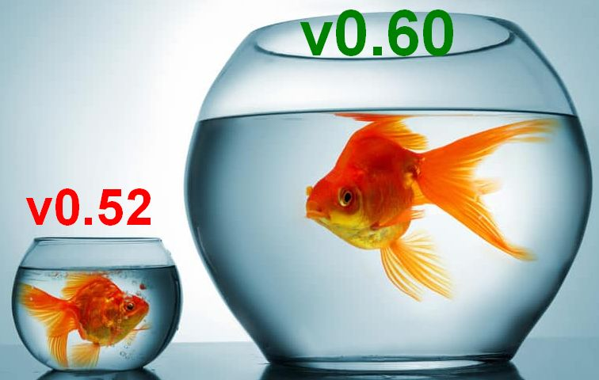
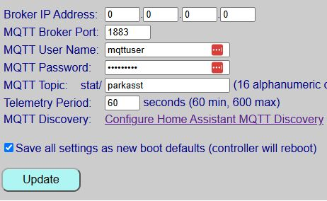
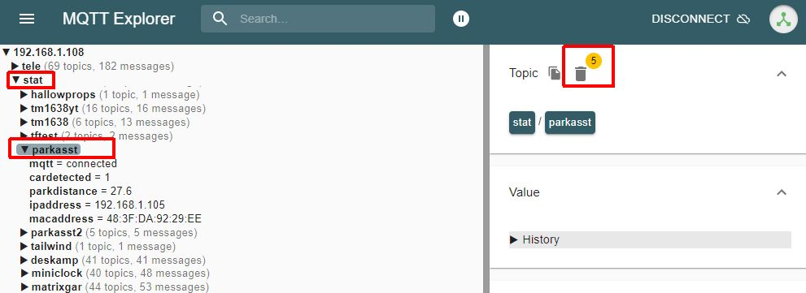

# v0.52 (or earlier) Migration Guide
{: .no_toc }

  

With the complete redesign of the firmware starting in v0.60, the binary size grew to occupy **99% of the default ESP32 application partition**. Living at 99% capacity is a dangerous game—a minor bug fix or library update could push the sketch over the limit, causing builds to fail or flashing to crash.

To fix this, v0.60+ moves the controller to a **Minimal SPIFFS** partition scheme (see [Partitions & Flashing](advancedpartitions) for technical details). Under the new partition map, the firmware only consumes **66% of available space**, leaving plenty of headroom for future features, patches, and safe wireless updates.

UNFORTUNATELY THE CHANGE IN PARTITION SIZE REQUIRES WIPING <u>ALL</u> DATA ON THE ESP32

If you are upgrading from v0.52 or earlier, you have two choices: **Migrate Now** (clean slate) or **Upgrade In-Place** (living on the edge).

---

## Option 1: Complete Migration (Recommended)

Biting the bullet now sets your controller up for seamless wireless updates for all future releases. 

### Phase A: Pre-Migration Preparation

 **Step 1: <u>Record Your Current Settings</u>**

Legacy versions (pre-v0.60) did not include the **Config Dump** feature to get a list of current settings. Before wiping the board, take screenshots or write down your existing settings from the old web app:
* The device name
* Total LED count, Brightness Levels and Wiring Connection
* Active Park and Exit Time
* Zone distances (Wake, Active, Parked, Backup) and, if installed, side sensor thresholds/position
* Custom zone colors and brightness levels
* MQTT Settings if enabled, _especially the /stat and /cmnd topics_ as you'll likely want to reset these to the same topics after migration

**Step 2: <u>Disable & Remove Legacy Home Assistant Discovery</u>** 
*(Skip if you do not use Home Assistant Discovery)* 
v0.60+ introduces over 20 new entity types and bidirectional control logic. To prevent duplicate or orphaned entities in Home Assistant:
1. Open your current web interface.

2. If you did not rename your entities in Home Assistant, note the current 'device name' from the entities (e.g. for the entity `sensor.parkasst_car_presence` **parkasst** is the device name). <i>If you use the same Discovery device name when running Discover after migration, these same entities will be recreated.</i>

    - Note the the 'Discovery device name' is separate and independent from either the device name assigned during onboarding or the MQTT topics entered for MQTT, and is specified only when enabling Discovery.

3. If you **did** change entity names, note the names so you can easily re-map them after migrating.

4. Click **Disable Discovery** via the Parking Assistant web app to issue a clearance payload to Home Assistant, which will remove the old device and all related entities.

**Step 3: <u>Disable MQTT & Purge Legacy Topics</u>** 
*(Skip if you do not use MQTT)* 
Because state topic formats changed in v0.60, legacy retained messages left on your broker will create "ghost" data alongside new topics. 
 
<i>Disable active MQTT</i>
1. Note your current base MQTT subscribe/publish topics.
2. Set your broker IP to `0.0.0.0` in the old web app, check **Save as Defaults**, and save to disable MQTT.

   
  <i>MQTT Setup form from version 0.52</i>

 
<i>Purge old retained topics</i> 
3. Open [MQTT Explorer](https://mqtt-explorer.com/) (or other utility) on your computer and connect to your broker.
4. Navigate to your old root topic (e.g., `stat/parkasst`), highlight it, and click the **Trash Can** icon to purge old retained state topics.

   
  <i>Purging legacy retained topics in MQTT Explorer</i>

---

### Phase B: Flashing & Onboarding
Migrating partition maps requires a one-time wired flash via USB. **It cannot be performed wirelessly.**

**Step 1: <u>Disconnect External Power</u>**

Power down the system completely. If your ESP32 is socketed into header pins, pop the board out and take it to your computer. Or if the controller assembly can easily be disconnected from the sensor(s) and LED strip, just bring the entire controller to the computer. If the ESP32 is soldered in place or you cannot easily remove the controller box, bring a laptop to the garage.  If the LEDs are powered via the controller, also disconnect the LEDs from the controller if possible.

> **⚠️ Dual Power Warning** Never plug the ESP32 into USB while an external 5V power supply is actively powering the board. Disconnect external power first to avoid brownouts or hardware damage.
{: .warning }

**Step 2: <u>Flash the Full Firmware Image</u>**

1. Connect the ESP32 to your PC using a verified **USB Data Cable** (charge-only cables will not create a COM port).
2. Open the [Firmware Installation](installation#-install-full-firmware-here) page on this documentation site.
3. Use the built-in WebSerial flasher to upload `ParkingAsst_v0.6x_Full.bin`.

**Step 3: <u>Onboard & Restore Hardware Configuration</u>**

1. Re-insert the ESP32 into your build (if removed), reconnect LEDs and sensor(s) if disconnected and apply power.
2. Follow the [Onboarding Guide](onboarding) to join the `Parking_Assistant_AP` hotspot and connect the controller to your Wi-Fi.  Use the same **Device Name** as before.
3. Once connected to WiFi, open the new web interface (it should have the same IP address as before) and navigate to **Hardware Settings** to configure your pins, LED count, and sensors as outlined in [Hardware Configuration](initconfig).  Be sure to set your desired Units (inches or millimeters) to the same selection as before migration.

---

### Phase C: Restoring User Preferences

1. **Zone Distances:** Re-enter your measurements under [Setting Zone Distances](zonedistance).
2. **Colors & Effects:** Customize your LED palette and approach animation under [Zone Colors & Effects](zonecolors).
3. **Smart Home Integration:** Re-enable [MQTT](mqtt) and trigger [Home Assistant Discovery](discoverymanage) if desired*.

**👉 Note for Discovery Users** If you use the same device name as before, then your entities for the park, side and car presence will be recreated with the same entity names, fixing any 'temporarily' broken dashboards or automations!   Example: If your old entity name was `sensor.parkasst_park_distance` (where <b>parkasst</b> is the device name), enabling Discovery with the same device name will recreate the prior entities.
{: .note}

Your system is now fully modernized on the v0.60+ framework and ready for future one-click wireless updates!

---

## Option 2: In-Place Upgrade (Not Recommended)

  

> **🛑 Hardware & Firmware Compatibility Pre-Requisites** In-place updates are **only** possible if your current system is already running **v0.50 or later on an ESP32**. Support for the ESP8266 was dropped in v0.52. If you are running v0.46 or earlier using an ESP8266, **you cannot use this new firmware.**
{: .note }

If you choose to perform an ESP32 in-place update by uploading `ParkingAsst_v0.6x_Update.bin` through your existing web app interface, you are choosing to "live on the edge."

### Why In-Place Upgrades Are a Trap

* **The Partition Dead-End:** The firmware will flash into your existing, tight application partition with less than 1% of free space remaining. The very next patch or bug fix released will exceed the partition boundary, forcing you to perform a full USB migration anyway.
* **No OTA Safety Net:** Standard double-bank OTA updates require free flash space to stage the incoming file. Operating at 99% capacity means any transmission hitch will fail the update and drop the board into a recovery state.
* **Corrupted Smart Home Topics:** Attempting an in-place upgrade without performing the MQTT/Discovery cleanup steps in Phase A will flood Home Assistant with conflicting entity structures and broken state topics.

If you still wish to attempt an in-place upgrade and are using MQTT or Home Assistant Discovery, you should complete **Phase A (Pre-Migration Preparation)** above to remove the Discovered device and clean your MQTT broker first, then upload the `_Update.bin` file via your existing controller's update screen. If the update succeeds, check all settings (there will be new ones) and re-enable MQTT/Discovery if desired.

If the flash fails or bootloops, proceed directly to Option 1 to perform a fresh USB install.

>⚠️ **This method has only been minimally tested!** In essence, the only testing done with this method is to verify that the update file flashes and boots.  Full system testing has not been performed for many of the new features.  If all else fails, you can fall back to migrating your system, or reinstall the old version and live for eternity on v0.52!
{: .important}

  <a href="{{ '/firmwareupdates' | relative_url }}" class="btn btn-outline"><- Previous: Installing Updates</a>
  <a href="{{ '/modifications' | relative_url }}" class="btn btn-purple">Next: Modifying the Firmware -></a>

