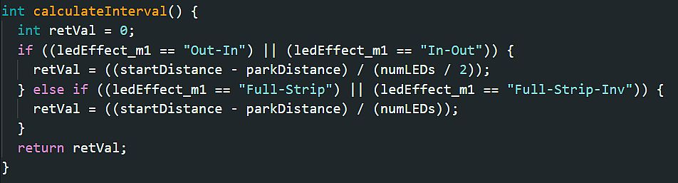

# Modifying the Firmware
{: .no_toc }

---

  

This section is intended for advanced users comfortable with C++, HTML, and CSS. It provides a high-level overview of the project structure and the requirements for compiling the code from source. 

> **🚀 Disclaimer: To Boldly Go...** I am happy to answer general questions about how the standard firmware works, but once you begin modifying the code, you are on your own! I cannot provide support for custom forks or deep troubleshooting for modified logic.
{: .important }

## File Organization
The most efficient way to customize the project is to clone or fork the [ESP-Parking-Assistant](https://github.com/Resinchem/ESP-Parking-Assistant) repository. This ensures you have the correct directory structure for the Arduino IDE.

If you do not have a Github account, or prefer to download the files manually, you will need the following files, found in the `src` (source) folder:
* **Main Sketch:** `parking_assistant.ino`
* **Supporting HTML:** `html.h`

Refer to the [Advanced Topics]({{ '/advanced' | relative_url }}) for a deep dive into the specific files and their intended roles within the system.

## IDE Configuration
While you can use various environments (like PlatformIO), the firmware was developed using the standard **Arduino IDE**. 

### Minimum Requirements
* **Arduino IDE:** Version 2.3.x or later.
* **ESP32 Board Support:** Ensure the Espressif board manager URL is added and the ESP32 platform is installed.
* **Libraries:** All external dependencies are listed at the top of the main `.ino` sketch file.

> **💡 Library Versions** Where possible, specific version numbers used during development are listed in comments next to the `#include` statements. If you encounter compilation errors, verify that your local library versions match these requirements.
{: .note }

**Example:**
`#include "VL53L0X.h"  // ToF Sensor: v.1.3.1`

## Board & Compiler Settings
Due to the complexity of the firmware and the size of the web application, standard ESP32 partition schemes will not work. You must use the following settings in the **Tools** menu:  

* **Board:** `ESP32 Dev Module`
* **Partition Scheme:** `Minimal SPIFFS (1.9MB APP with OTA/190KB SPIFFS)`
* **Flash Frequency:** `80MHz`
* **Upload Speed:** `921600` (or lower if your cable/bridge is unstable)
* **Core Debug Level:** `None` (Set to `Info` or `Debug` only when troubleshooting)

<i>If using a different board type, change the above settings to match your particular requirements.</i>

### Debugging
If you are modifying code and need to monitor the output, the Serial Monitor should be set to **115200 baud**. Note that since the system was designed to operate wirelessly, Serial output is disabled by default as a wired connection is required for output.  To enable for troubleshooting, locate the following line near the top of the source code and change the "0" to a "1":

`#define SERIAL_DEBUG 0`  //Set to 1 to enable, 0 to disable.

It is recommended that you set this back to disabled (0) after troubleshooting and before operating in wireless mode again.

  <a href="{{ '/migration' | relative_url }}" class="btn btn-outline"><- Previous: v0.5x Migration Guide</a>
  <a href="{{ '/advanced' | relative_url }}" class="btn btn-purple">Next: Advanced Topics -></a>

