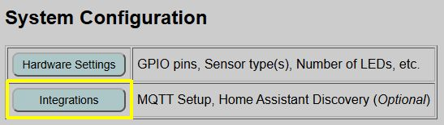
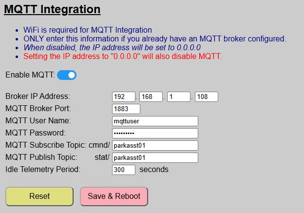

# MQTT Setup and Configuration
{: .no_toc }

---

  

If you wish to use MQTT with the system, you must meet a few prerequisites and also enable and configure MQTT in the web application. 

**MQTT is not available in [AP Mode] - WiFi is required**
{: .label .label-yellow }

## Prerequisites
To use MQTT you must have a local MQTT broker available on your network. While you can technically use a cloud-based MQTT provider, this is not recommended due to the lag introduced between sending a command and having it received by the system. One of the most popular free local versions is [Eclipse Mosquitto](https://mosquitto.org/).

If you are a Home Assistant user, you can turn Home Assistant into your MQTT broker by installing the MQTT broker app/add-on.

## Understanding Topics
MQTT works using a subscribe/publish method. The system allows you to define these topics, and your external system must use these same topics for proper communication.

* **Publish (stat/):** All messages sent by the controller are published to a topic prepended with `stat/`.
* **Subscribe (cmnd/):** All topics subscribed to by the controller are prepended with `cmnd/`.

## Enabling and Configuring MQTT
MQTT configuration is found under the primary controller's **Integrations**, accessible from the main page of the web application.

MQTT Setup is listed at the top of the optional integrations page.

You can simply slide the toggle to enable or disable MQTT.  When disabled, the remaining fields are locked.

>⚠️**Situations that Prevent ENABLING MQTT**  - Your system is in Access Point (no WiFi) mode. MQTT requires WiFi.  ⚠️**Situations that Prevent DISABLING MQTT**  - You have a Discovered Device in Home Assistant.  The device must be removed before MQTT can be disabled.
{: .important}

When enabling MQTT, you must also complete the following fields (all are required):

Field|Details
----|----
Broker IP Address|The IP address where your broker lives.  If using the Home Assistant MQTT add-on, then this will be the IP address of your Home Assistant. Note that entering an IP address of `0.0.0.0` will also disable MQTT.
MQTT Broker Port|Normally this is 1883, but set to the proper port for your broker.
MQTT User Name|The name of a valid user for the broker.  If applicable, this user should have permission to both read (subscribe) and write (publish) to topics.
MQTT Password|The password for the MQTT user account.
MQTT Subscribe Topic|The MQTT Topic that the Parking Assistant will subscribe to and listen for external commands. The topic entered here is automatically prefixed with `cmnd/`, indicating 'commands'. The topic may be up to 16 alphanumeric characters.  Spaces and symbols are not permitted.
MQTT Publish Topic|The MQTT topic where the Parking Assistant will publish its states.  The topic entered here is prefixed with `stat/` to indicate 'state'. The topic may be up to 16 alphanumeric characters.  Spaces and symbols are not permitted.
Idle Telemetry Period|How often, in seconds, the system refreshes the sensor and zone states when the system is in standby mode.  See the discussion below.

> **💡 Integration Tip** Since the system prepends `stat/` and `cmnd/` automatically, you can use the same string for both (e.g., `parkasst`) to simplify your naming convention.
{: .note }

### Additional Information on Topics
As mentioned above, the system automatically prepends `cmnd/` to your subscribe topic and `stat/` to your publish topic.  This is to keep commands and state updates separate and avoids potential "ghosting" issues due to retained command topics.

For example, if you enter `parkasst` as both the subscribe and publish topic, then state topics will be published from the Parking Assistant to the broker using the base topic of `stat/parkasst/...`.  These are generally published with a retain flag of **TRUE**.

Similarly, the Parking Assistant system will subscribe and listen for commands posted to the base topic of `cmnd/parkasst/...`.  Commands issued to these topics from third party systems should post them with a retain flag of **FALSE**.

## Telemetry Period and When State Topics are Updated
 
<b><u>During The Boot Up Process</u></b> 
When MQTT is enabled, the system publishes all initial states immediately after the boot process finishes.  To avoid a blocking situation in the main loop, states are placed in a queue and updated sequentially as the main loop runs.  This just means that when the system first boots, it will take a few seconds before all the states are updated on the broker.

<b><u>When an Active Setting is Changed</u></b> 
If you make a change to an active setting (e.g. a zone color, distance or LED brightness), the change is immediately published to the broker.  Changes to Default values require a reboot, so these changes are published following the reboot process.

<b><u>When the System is Awake and Tracking</u></b> 
When the system detects a car and exits standby mode, MQTT states related to the sensors, zones and car presence are updated approximately once per second.  This includes the following:
- Front sensor distance
- Side sensor distance (if connected and enabled)
- Current Occupied Zone
- Car presence (home/away)
- LED State and color

<b><u>When a Vehicle is Departing</u></b>
By design, the system does not wake or become active when a car departs.  However, as soon as the car clears all zones and the "Exit Time" expires, the following topics are updated one time:
- Front sensor distance
- Side sensor distance (if connected and enabled)
- Zone will be updated to 'Vacant'
- Car presence will be updated to 'Away' (off)

<b><u>When the System is in Standby Mode</u></b> 
When the system is in standby mode, whether a car is present or absent, there really isn't a reason to continually pound the MQTT broker with constant sensor or zone updates.  When the system is idle, then these states are only updated once per the 'idle telemetry period' that you specify.  This could be a range from 60 to 600 seconds.  In practice, you should not need to update these states any more than once every 3-5 minutes (180-300 seconds), but you can make the period longer or shorter if you have a particular need.

## Saving and Updating MQTT Configuration Changes
If you make any changes to the MQTT settings, <i>including simply toggling the enable switch</i>, you **must** click the 'Save &amp; Reboot' button to commit your changes.  MQTT settings are saved in your primary configuration file and MQTT is enabled during the boot process, so any changes (including just enabling/disabling MQTT), require this save and reboot process.

If you've made changes and not yet saved them, you can use the 'Reset' button to restore all fields to the last saved default values.

  <a href="{{ '/integrationmain' | relative_url }}" class="btn btn-outline"><- Previous: Optional Integrations</a>
  <a href="{{ '/mqtttopics' | relative_url }}" class="btn btn-purple">Next: MQTT Topics &amp; Payloads -></a>

