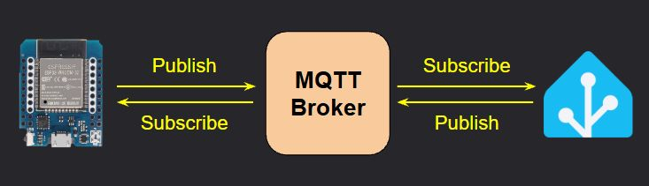

# MQTT Topics and Payloads
{: .no_toc }

---

<p align="center">
  
</p>
**MQTT is not available in [AP Mode] - WiFi is REQUIRED**
{: .label .label-yellow }

This page simply lists the available state and command topics, along with the payload type and an example where needed.  Be sure you've enabled and configured MQTT according to the previous section.
<br><br>
<b><u>Substitutions</u></b>
<br>


For this document, `[subscribe_topic]` and `[command_topic]` represent the topics entered in the [MQTT Setup &amp; Configuration](mqtt).

---

## State Topics
These topics are published FROM the Parking Assistant TO the MQTT broker.

- All Topics are preceded with <b>`stat/[publish_topic]`</b> 
  - Example Full Topic: `stat/parkasst01/ledstate`)
- Unless otherwise specified, all state topics are published with a retain flag of `TRUE`.

Topic `stat/[publish_topic]...`|Payload|Notes
----|:---:|---
`/status`|`online` or `offline`|State of the system.  Populated via Last Will and Testament.
`/ipaddr`| IP address | IP address of the controller (e.g. `192.168.1.225`)
`/macaddr`| MAC address | MAC Address of the controller's ESP32 (e.g. `94:B9:7E:E6:BD:9F`)
`/version`| `vX.XX (ESP32)`|Current firmware version number
`/ledstate`|`ON` or `OFF`|Current state of LED strip
`/sensoroverride`|`ON` or `OFF`| State of the sensor override switch
`/parkdistance`| number | Distance reported by front sensor.  Will be in published in units defined under hardware settings (inches or millimeters).
`/sidedistance`| number | Distance reported by the side sensor (if installed and enabled). Inches or millimeters based on system's unit selection.
`/carpresence`|`ON` or `OFF`|Indicates presence of vehicle (object) in a zone
`/zone`|`Wake`, `Active`, `Parked`, `Backup`, `Vacant`|Indicates the zone of the vehicle or object. `Vacant` when no object detected.
`/ledbrightness`| 1 - 255|LED brightness (when system is in 'active' mode)
`/brightnesssleep`| 0 - 255 | LED brightness (when system is in 'standby' mode)
`/ledcolor`| rr,gg,bb | Comma-delimited string of red, green and blue that comprises the current (or last) LED color.  Each value ranges from 0-255. Example: `255,0,0` = red.
`/colorwake`| HEX Color (`#000000`)|HEX Color code for the Wake Zone.
`/coloractive`| HEX Color (`#000000`)|HEX Color code for the Active (approach) Zone.
`/colorparked`| HEX Color (`#000000`)|HEX Color code for the Parked Zone.
`/colorbackup`| HEX Color (`#000000`)|HEX Color code for the Backup Zone.
`/colorstandby`| HEX Color (`#000000`)|HEX Color code for the Standby LEDs.
`/colormanual`| HEX Color (`#000000`)|HEX Color code when LED color is manually set (e.g. via MQTT or API).
`/effect` | `Out-In`, `In-Out`, `Full-Strip`, `Full-Strip-Inv`, `Solid`|Active zone LED effect setting.  Matches one of the values from the Effect drop down on the main web page.
`/distwake`|number|Wake zone distance setting.  Will be reported in inches with a single decimal (e.g. `54.7`) when inches are the system units, otherwise as an integer (e.g. `1458`) for millimeters.
`/distactive`|number|Active zone distance setting.  Reported the same as wake distance (in or mm).
`/distpark`|number|Parked zone distance setting.  Reported the same as wake distance (in or mm).
`/distbackup`|number|Backup zone distance setting.  Reported the same as wake distance (in or mm).
`/sidedistleft`|number|Side sensor LEFT distance setting.  Reported the same as wake distance (in or mm).  Will always show `0` if not installed or enabled.
`/sidedistright`|number|Side sensor RIGHT distance setting.  Reported the same as wake distance (in or mm).  Will always show `0` if not installed or enabled.
`/light`*| JSON Payload|Primarily for use by the Home Assistant light card.  *See discussion below for more information.

All state topics are initially published following the initial system boot.  See the prior section [MQTT Setup &amp; Config](mqtt) for information as to when state topics are updated.

### *Special `/light` Topic

This special topic is included due to the way that a 'light' entity is handled in Home Assistant.  A light entity contains additional details such as color and brightness, as 'attributes' of the light entity.  For that reason, Home Assistant expects a light entity to be reported (or set) using a JSON payload structured as follows:
```JSON
{
  "state": "OFF",
  "brightness": 100,
  "color_mode": "rgb",
  "color": {
    "r": 255,
    "g": 255,
    "b": 0
  }
}
```
<i>For WS2812b LEDs, the color mode will always be</i> `rgb`. <i>All other values are reported the same as their corresponding individual topics.</i>

---

## Command Topics
These topics are subscribe TO by the Parking Assistant FROM commands published to the MQTT broker by other systems.

To provide the greatest flexibility when interfacing with third-party systems, some commands contain different topics that perform the same action:

- `/ledbrightness` and `/brightness` will both set the active LED brightness.

Other topics may accept different variants of the payload to set the same state:
- `ON`, `1`, or `TRUE` can be used to set a state of a value to "ON".

<b><u>Addtional notes on Command Topics:</u></b>
- All Topics are preceded with <b>`cmnd/[subscribe_topic]`</b> 
  - Example Full Topic: `cmnd/parkasst01/ledstate`)
- For colors, where an RGB or HEX color string can be passed as a payload, either format is valid and will be processed:
  - RGB String example: `255,48,281`
  - HEX String example: `#ff2f1c` (leading `#` is optional and may be included or omitted)
- Unless otherwise specified, all command topics should be published with a retain flag of `FALSE`.

>⚠️ **Remember the Sensor Override!**<br>If attempting to manually control the LEDs, first set the Sensor Override setting to "ON". If you fail to do so, any triggers by the sensors will overwrite your changes.<br><br><b>Don't forget to set the override back to "OFF" to return system to normal operation!</b>
{: .important}

Topic `cmnd/[subscribe_topic]...`|Valid Payload(s)|Notes/Example
----|:---:|---
`/sensoroverride`|`ON`/`1`/`TRUE` or `OFF`/`0`/`FALSE`|Sets the state of the sensor override switch.
`/ledstate`|`ON`/`1`/`TRUE` or `OFF`/`0`/`FALSE`|Turns the LED strip 'on' or 'off'.
`/ledcolor`<br>`/color`<br>`/colormanual`|RGB or HEX color string |Sets the color of the LEDs. Payload can be comma-separated RGB string (e.g `255,48,28`) or a Hex color string (e.g. `#ff2f1c`).
`/ledbrightness`<br>`/brightness`| 0 - 255 |Sets current (active) LED brightness. Out-of-range values will be constrained to 0 or 255.
`/brightnesssleep`<br>`/sleepbrightness`| 0 - 255 |Sets standby (sleep) LED brightness. Out-of-range values will be constrained to 0 or 255.
`/colorwake`|RGB or HEX color string |Sets the color for the Wake zone. Payload can be comma-separated RGB string (e.g `255,48,28`) or a Hex color string (e.g. `#ff2f1c`).
`/coloractive`|RGB or HEX color string |Sets the color for the Active (approach) zone.
`/colorparked`|RGB or HEX color string |Sets the color for the Parked zone.
`/colorbackup`|RGB or HEX color string |Sets the color for the Backup zone (flashing). Also sets the side sensor color, if installed and enabled.
`/effect`|`Out-In`, `In-Out`, `Full-Strip`, `Full-Strip-Inv`, `Solid`|Sets the Active (approach) zone LED effect.  Must match an existing effect from the dropdown on the main web page or command will be ignored.
`/distwake`| 12-192 (inches)<br>305-4980 (mm)|Sets the Wake zone distance. Payload range depends upon the system's unit settings (inches or millimeters). <i>Out-of-range values will be constrained to the appropriate minimum or maximum value.</i>
`/distactive` or<br>`/diststart`| 12-192 (inches)<br>305-4980 (mm)|Sets the Active zone distance. See `/distwake` notes.
`/distpark`| 12-192 (inches)<br>305-4980 (mm)|Sets the Parked zone distance. See `/distwake` notes.
`/distbackup`| 12-192 (inches)<br>305-4980 (mm)|Sets the Backup zone distance. See `/distwake` notes.
`/sidedistleft`| 2 - 48 (inches)<br>50 - 1220 (mm)|Sets the side sensor LEFT distance.  Ignored if side sensor not enabled. <i>Out-of-range values will be constrained to the appropriate minimum or maximum value.</i>
`/sidedistright`| 2 - 48 (inches)<br>50 - 1220 (mm)|Sets the side sensor RIGHT distance.  Ignored if side sensor not enabled. See `\sidedistleft` notes.
`/light`*|JSON Payload|Passed by the Home Assistant Light entity.  Not normally used independently, but can be to set the LED state, color and brightness via one publish statement.  Automatically enables sensor override! *See additional notes below.

### Additional Notes on MQTT Commands

>⚠️**MQTT ONLY UPDATES "ACTIVE" SETTINGS**<br>When system settings (such as LED brightness or zone color/distances) ar updated via MQTT, they only change the current 'Active' settings.  If the system reboots for any reason, these changes will be lost and the last saved 'defaults' will be loaded.<br><br>To update save any changes made as the new 'Defaults', a direct command can be issued <i>(see below)</i> to force a save of the current active values.
{: .important}

<b><u>Constraining Numeric Values</u></b><br>
For commands where the payload is a numeric value range, out-of-range values are 'constrained' to a valid value.  For example, given a payload range of `50-100`, passed values < 50 will be set to `50`.  Passed values > 100 will be set to `100`.

However, MQTT does not validate distances as it does on the web page.  Using MQTT, you can set a parked zone that is further away than the active zone.  In this case, the system would not respond appropriately.  Use caution when manually setting distances via MQTT and assure the final zone settings are appropriate.

### *Special `/light` Topic
This is normally used by the Home Assistant light entity card, but can also be used to set the LED state, color and brightness in one command by formatting the payload in a special JSON format:
```JSON
{
  "state": "OFF",
  "brightness": 100,
  "color_mode": "rgb",
  "color": {
    "r": 255,
    "g": 255,
    "b": 0
  }
}
```
>🛑 **Sensor Override Automatically Enabled when using `/light`!**<br>When a JSON payload is sent to the `/light` topic, the sensor override switch will <i>automatically</i> be set to `ON`.  Don't forget to reset the sensor override back to `OFF` after manually interacting with the LEDs to return the system to normal operation.
{: .warning}

## Direct Commands
The commands loosely correspond to the [Controller Commands](commands) found on the main web page, but provide a way to initiate some system functions via MQTT.

>1️⃣ **Payloads Ignored**<br>For these commands, a payload is required but ignored when processed.  It is recommended that you simply pass a "1" as the payload for each of these special direct commands.
{: .note}

Topic `cmnd/[subscribe_topic]...`|Payload (ignored)|Notes/Example
----|:---:|---
`/restart`| 1 | Immediately reboots the controller
`/refresh`| 1 | Forces an immediate update of all MQTT State (/stat) topics to be published.
`/otaupdate`| 1 | Puts the system in Arduino OTA flashing mode for transferring a custom firmware build.
`/saveconfig`| 1 |Forces all current 'Active' settings to be saved as the new 'Default' values.  The controller will reboot when this command is issued.

>⚠️<b>`/saveconfig` saves ALL active settings!**</b><br>When a `/saveconfig` command is issued, it saves <b>all <i>current</i></b> active settings, not just those recently changed via MQTT.  Use with caution or you may commit unplanned values to the system defaults.
{: .important}

<div style="display: flex; justify-content: space-between; align-items: center; margin-top: 40px; border-top: 1px solid #333; padding-top: 20px;">
  <a href="{{ '/mqtt' | relative_url }}" class="btn btn-outline"><- Previous: MQTT Setup &amp; Config</a>
  <a href="{{ '/api' | relative_url }}" class="btn btn-purple">Next: API HTTP Commands -></a>
</div>


