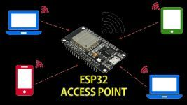
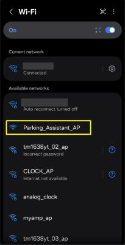
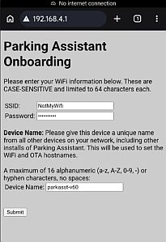
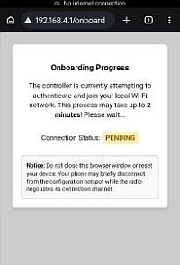
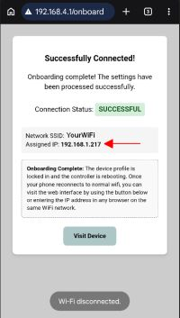
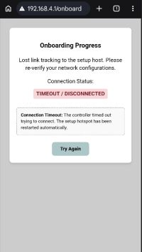

# Onboarding and First Time Setup
{: .no_toc }

---

  

Once you have successfully flashed the firmware to your Primary and Display controllers, the next step is to connect them to your local Wi-Fi network. 

**🌐 Local Network Reminder** While this device requires a Wi-Fi connection for the initial setup, they **do not** require any Internet access for full functionality. Switching to "**Access Point (no WiFi)**" mode can be done after initial onboarding and setup.
{: .note }

## 1. Joining Local WiFi
For the initial onboarding and setup, WiFi is required.  If your planned location does not have reliable WiFi, you can complete these initial steps in a different location, such as inside your house.  Only the ESP32 is needed for this step, so you can flash and onboard it before assembly, or if you used the recommended pin headers, simply remove the ESP32 and take it to a WiFi-enable location.

**🚫 Special No WiFi Mode** While mentioned a few times, you can opt to run the system in "Access Point" mode for situations where WiFi may not be available, such as in a detached garage or outbuilding.  However, the initial onboarding and setup steps need WiFi.  So, flash and complete these steps in an area where WiFi is available.  After setup, you can switch off WiFi before final installation.
{: .important }

### Step 1: Join the Hotspot
Once flashed, the controller will broadcast its own Wi-Fi network. It’s essentially a very tiny, very exclusive club where the only item on the menu is "Configuration." If your phone warns you that the network has no Internet access, take a deep breath. <i>Shall we play a game?</i> No—we're just setting up Wi-Fi IP, not launching global thermonuclear war. Select 'Stay Connected' and proceed.

The default name for the Wi-Fi hotspot is: `Parking_Assistant_AP`

_As noted earlier, these hotspot names may show your assigned DeviceName_AP instead of the above._

Use a phone, tablet, or laptop to join the hotspot. Remember, if your device warns you that there is "No Internet Connection," select **Stay Connected**.

### Step 2: Access the Onboarding Form

Depending upon your device and operating system, selecting the AP will automatically open a browser and display the onboarding page.  However, if this doesn't happen, simply open a web browser and enter the IP address: **`192.168.4.1`**. The onboarding form will appear: 

Fill out the following common fields for both controller types:
* **SSID:** Your Wi-Fi network name (must be the same network as device being used to onboard).
* **Password:** Your Wi-Fi password.
* **Device Name:** A unique, short name (up to 16 alphanumeric characters plus the hyphen [-], no spaces). 
    * *Examples:* `ParkAsst-01` or `Garage-Left`. 
    * Each controller on your network **must** have a unique name.
      * The device name is not only used to help you identify which controller is being accessed via the web application, but this is also used for the WiFi connection and as the MQTT client if MQTT is enabled.  Therefore, all devices should have a unique name across all other devices on your local network.

>⚠️ **Verify All Information Before Submitting!** Once the system successfully joins WiFi, any future changes of the **WiFi credentials** or the **Device Name** will require a full [system reset](commands#reset-all) and onboarding again.
{: .important}

### Step 3: Submit and Verify
Once you have completed all fields, click **Submit**. The controller will reboot and attempt to join your network. The onboarding page on your mobile device will show the connection status.

Depending on your WiFi strength, it may take up to two minutes for the connection to be established.  Do not navigate away from the status page or change the Wifi connection on your mobile device during this process.

Once the controller successfully joins your WiFi, the status page will update to a 'Success' message and the page will show your SSID and more importantly the <b>newly assigned IP address</b> for the controller.  This is the IP address you will use to access the firmware's web application and settings.

The controller will stop broadcasting the hotpsot and your phone or mobile device will disconnect and <i>should</i> reconnect to your normal WiFi.  Once this step is complete, you can even use the 'Visit Device' button to immediately go to the controller's web interface.

Another visual indicator is, that by default, the _blue_ LED on the ESP32 will light up when a successful WiFi connection is made.

You can toggle this feature off later if you do not want the blue LED to remain on.

But if the controller is unable to connect to your WiFi for any reason, the following status page will be shown instead:

If you see the above status page instead of the 'Success' page, it means the controller was unable to connect to your WiFi using the provided information.  This could be an improperly entered SSID or password (these are CASE-SENSITIVE), a firewall issue or other network-related problem.  When this occurs, the hotspot will start broadcasting again.  If you are still on the hotspot WiFi, you can simply click 'Try Again' to return to the onboarding page.  If your phone disconnected from the original hotspot, you'll need to reconnect before returning to the main `192.168.4.1` onboarding page.

If you run into any issues with the onboarding process, see the [Troubleshooting](troubleshooting) section for common issues and resolutions.

## 2. Assign Static or Reserved IP Addresses

This step is optional, but I recommend assigning a static or reserved IP address to the controller.  This way, you'll always use the same address to access the web interface.  If you don't implement this option and your router, at some point in time, assigns a new IP address, you'll have to locate this IP before you can reach the web app.

1. Open your router's configuration page.
2. Create a **Static Reservation** for the Parking Assistant Controller.
3. Power cycle each device to ensure they are using the newly assigned static IPs.

---

## 3. Final Hardware Integration
At this point, you should move your controllers from your computer to their final positions (either on a breadboard or to their permanent soldered board). 

**🚫 No WiFi Mode** If you are planning on enabling the WiFi mode and your installed location does not have reliable WiFi, you can enable that option before moving the controller.  See the following section on [Access Point Mode](nowifimode) for more informaion.
{: .warning }

### Build Resources
If you haven't completed the physical build yet, refer to these guides:
* **[YouTube Overview]({{site.links.youtube_video}})**
* **[Written Build Guide](https://resinchemtech.blogspot.com/2026/08/parking-assistant-2026.html )**

> **⚠️ Additional Setup Required**  Don't expect the system to function as expected immediately after onboarding. Initially, the system will use a number of default startup settings.  This includes things like the number of LEDs, power settings, zone distance and colors and so on.  You will need to complete some additional hardware settings via the controller's web interface and save these changes to the local configuration for each controller after it is onboarded for full functionality.
{: .important }

Once your hardware is connected and powered, you can jump to the [Hardware Configuration](initconfig) section to finish the controller setup.

  <a href="{{ '/installation' | relative_url }}" class="btn btn-outline"><- Previous: Installation</a>
  <a href="{{ '/booting' | relative_url }}" class="btn btn-purple">Next: The Boot Process -></a>

