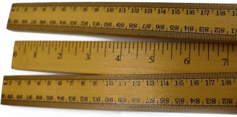
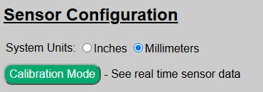
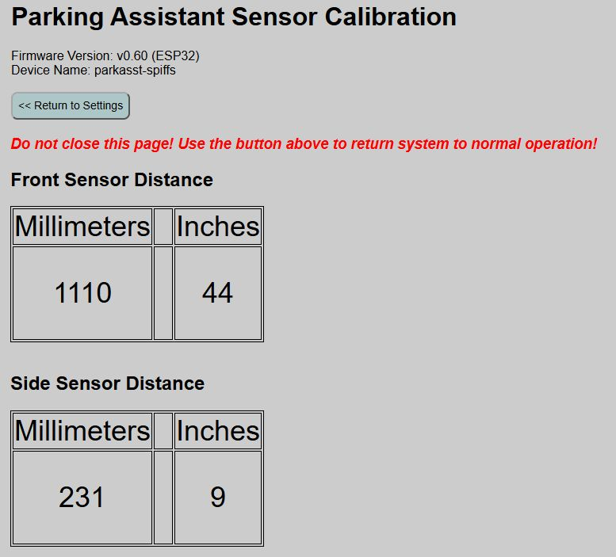

# Sensor Calibration
{: .no_toc }

---

  

On the hardware page under the sensor configuration section, you will find a "Calibration Mode" button.

This will open up a special calibration page where you can see real time data collected from the front sensor (TFMini-s) and the optional side sensor (VL53L0X) if installed and enabled.

>❗**IMPORTANT** When the system is in calibration mode all other system functions are paused.  This not only includes triggers for the LEDs, but MQTT updates, API calls, etc. are all disabled.  **Do not close your browser when in calibration mode!**  Use the provided button to return to the hardware settings page and restore the system to normal operation.  <i>If you do inadvertently close the page, just reopen the main web app page again. Opening any of the normal pages also restores the system.</i>
{: .warning}

### Using the Calibration Data

The Calibration page will display the current raw distance reading of the TFMini-s front sensor and the VL53L0X side sensor (if enabled), updated once per second.  Note inches are rounded to the nearest whole integer, even though zone distances permit entry in tenths of an inch (e.g. 24.6").

- The values will naturally "bounce" a bit, and even when detecting a solid, non-moving object, the reported distance may vary by a few millimeters between readings.  This is normal behavior.

- If a distance of "9999" is shown, it means no object is within the range of the sensor OR an error is being returned due to a problem with the sensor.  If you place an object within a foot or two, and directly in front of the sensor, yet still get a "9999" reading, check the sensor and wiring as something isn't working correctly.

- Values of N/A mean the sensor was not detected or is not enabled.

You can then use this calibration page to help place the sensor and to determine the starting trigger distances for the parking zones that you can fine tune later.   

No values from the page are saved or used for any settings.  It is informational only.  When done with the configuration, use the button at the top to return to the hardware settings page **and return the system to normal operation**.

  <a href="{{ '/zones' | relative_url }}" class="btn btn-outline"><- Previous: Parking Zones</a>
  <a href="{{ '/apmode' | relative_url }}" class="btn btn-purple">Next: Access Point Mode -></a>

