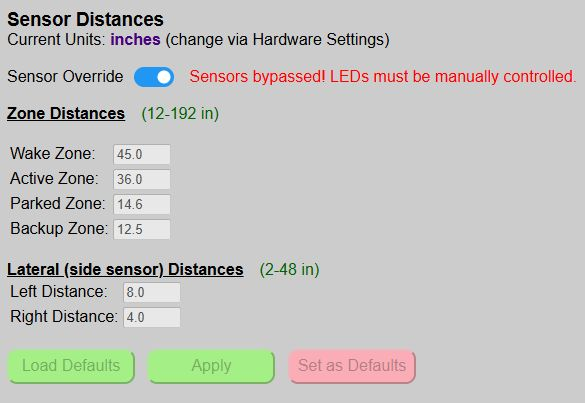

# Overriding the Sensors
{: .no_toc }

---

  

>🔎 For the purposes of this topic, "sensors" refers to both the front and side sensor.  If your system does not have a side sensor installed and enabled, then the information only applies to the front sensor.
{: .note}

The primary purpose for disabling the sensors is when you want to control the system (primarily the LEDs) via an external system, like Home Assistant.  For example, maybe you want to flash the LEDs in response to some event or trigger.  By overriding the sensors, the LEDs are completely under manual control and will not respond to any triggers from the sensors.
 
### Overriding the Sensors via the Web App

The master switch to disable the sensors can be found on the main web page under the sensor distance section.

>🔎 **Changing the Override Setting is Immediate!** The sensor override setting is the only setting on the page that takes effect <i>immediately</i> upon changing the toggle, without the need to 'Apply' or 'Save' the setting.
{: .warning}

When the sensors are disabled, you cannot make any changes to the zone or side distances.  MQTT updates, if enabled, will still occur, but sensor data will only be updated per the configuration teleperiod.  See the [MQTT Setup &amp; Config](mqtt) for more information on using MQTT.

### Remotely Disabling/Enabling the Sensors
As mentioned, the most common reason for disabling the sensors is so that the LEDs can be controlled manually from a third-party system.  But to use the LEDs in an external automation or script, that system also needs a way to disable the sensors before controlling the LEDs and then re-enabling the sensors when done.

Luckily the system supports this option via two methods: MQTT or the HTTP API.  The use of MQTT and the API are later covered under [Optional Integration](integrationmain) section, but as a quick example of how the sensor override might be used by an external system:

<b><u>MQTT Example</u></b>

For this example, the remote system would post an MQTT message such as the following to first disable the sensors (note the topic is defined as part of MQTT setup):

Topic: `cmnd/parkasst/sensoroverride` 
Payload: `on` 

Using a payload of `on` disables the sensors.  Additional messages could then set the state, color and brightness of the LEDs. 

Topic: `cmnd/parkasst/ledstate` 
Payload: `on`

Topic: `cmnd/parkasst/ledcolor` 
Payload: `255,0,0`

Topic: `cmnd/parkasst/ledbrightness` 
Payload: `128`

When the automation or manual control is complete, the system is returned to normal operating mode by turning the sensor override setting back to 'off'.

Topic: `cmnd/parkasst/sensoroverride` 
Payload: `off` 

<b><u>API Example</u></b> 

This is actually easier, since the API allows commands to be chained together in a single call.  Recreating the above process to disable the sensors and turn on the LEDs, set the color and LED brightness can all be done with a single API command:

`http://[your_controller_ip]/api?sensoroverride=on&ledstate=on&ledcolor=ff0000&ledbrightness=128`

Then to simply reenable the system:
`http://[your_controller_ip]/api?sensoroverride=off`

>⚠️ **Troubleshooting Note** If you find that the Parking System suddenly stops working, double-check the sensor override switch.  The issue could be that this setting was toggled on via an external system and never reset back to normal operating mode.
{: .important}

  <a href="{{ '/zonecolors' | relative_url }}" class="btn btn-outline"><- Previous: Zone Colors &amp; Effects</a>
  <a href="{{ '/commands' | relative_url }}" class="btn btn-purple">Next: Controller Commands -></a>

