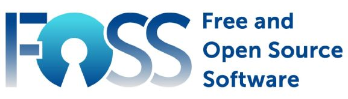

# Supporting this Project
{: .no_toc }

---

  

## Always Free and Always Open
This, along with my other projects, are completely free to use, fork, clone or otherwise use as you see fit.
- Never a cost to use the firmware.
- No "hidden" features that are locked behind a paywall.
- No subscriptions.
- No separate apps to download or install to use the system
- No data is collected.  No account creation required to use the system.
- No Ads!  Let me repeat this last one again.... **NO ADS** now or ever!

In other words, this project does not generate any revenue (nor does it collect data that could be sold).  However, it takes substantial time, effort and cost to develop and maintain this project and all the related documentation. I do this on my own time to share ideas and to serve as a learning resource for others.

If you found this project (or any of my others) useful and would like to show your support, there are a few options:

## Use My Amazon Links (no additional cost)
This actually doesn't cost you anything additional.  But when you use one of my links from a parts list (usually found in a written guide or in a YouTube video description), as an affiliate I may earn a small commission...  even if you eventually purchase a different part or version.  

## Buy Me a Coffee
If you'd like a more direct way to support my work, you can buy me a virtual cup of coffee or two.

## Just Leave Me a Comment (completely free!)

I love to hear from others that implemented one of my projects... or adapted it for other uses or even found ways to improve it.  The more I hear about the success of a project, the more motivation I have to continue to develop it.  So, if you do build a Parking Assistant, consider dropping me a comment in the YouTube or Blog comment area.  Or post a message in the project's [Github Discussion](https://github.com/Resinchem/ESP-Parking-Assistant/discussions) area.  

This can mean more to me than a monetary donation (although those are _greatly appreciated_ as well).

  <a href="{{ '/troublefaq' | relative_url }}" class="btn btn-outline"><- Previous: FAQ &amp; Getting Help</a>

