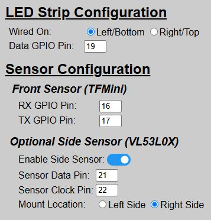
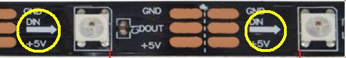
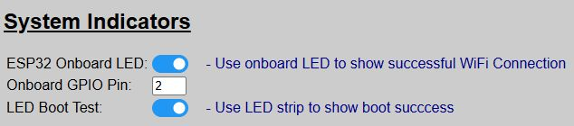
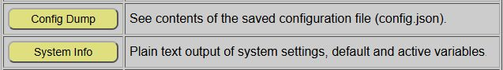
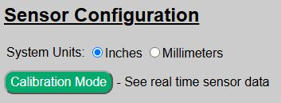

# Configuration & Hardware Issues
{: .no_toc }

---

  

If you can access the Parking Assistant's web application, this generally means the system has been successfully flashed and onboarded.  If the web application isn't available, then there is an issue with the flash/onboarding process.  Check the [Getting Started](startingmain) and the [Setup](setupmain) sections of this guide again to assure a step wasn't missed.

However, if you can access the web application but the system still isn't behaving as expected, there could be a minor misconfiguration or a true hardware issue causing the problem.  Here are some common things to review.

## Verify Proper Wiring and GPIO Pins
Double-check your wiring and GPIO pins.  It is very easy (and common) to get some pins reversed, like the TFMini's RX/TX pins or the VL53L0X side sensor's SDA and SCL pins.  The good news is that if you did get the GPIO pins reversed, you don't necessarily need to desolder and rewire.  Instead just change the GPIO pin assignment under the Hardware Settings via the web app.

Also assure that the proper hardware is enabled/disabled based on your build and that the wiring/mounting locations are correct.  Remember that if you make any changes to the hardware settings you **_must_** use the 'Save & Reboot' button to commit your changes and have them applied to the system.

>👉 **Verify LED Strip Wiring** Remember that addressable LED strips have a single data direction, so there is a 'start' and 'end' of the strip. This is indicated by an arrow on the strip:    If you wire the data line to the wrong end, only a single LED will light up.
{: .important}

## Enable All Boot Options

If not already enabled, assure the boot indicator options are enabled.  These use the ESP32's onboard LED along with the LED strip to indicate certain parts of the boot process.  These are described under the [Boot Process](booting) topic and can help identify where a particular issue may be occurring.  If desired, you can toggle these options back off after any problems are resolved.

## Use the Config Dump and System Info Features

The system provides two different debugging features, specifically designed to help with configuration issues.
- **Config Dump**: Shows the contents of the saved `config.json` file, saved locally on the ESP32.

- **System Info**: Full system information, including a listing of current 'Default' vs. 'Active' settings.

Review both of these options to see if a saved option is incorrect or maybe it's a situation where an 'active' setting is overriding the expected 'default'.  

## Verify Sensor Functionality

You can assure your sensors are functioning properly via the 'Calibration Mode' feature, found on the [Hardware Setup](initconfig) page.  This will provide real-time data from both the front sensor, along with the side sensor if installed and enabled.  If a sensor is reporting out-of-range (even when an object is placed a foot or so in front of the sensor) or an error is shown, review your sensor wiring and settings as covered above.

## If All Of the Above Checks Out...
If all wiring, hardware and the other checks above appear OK, but the system still isn't working as expected, check the following section on General Operational issues.

  <a href="{{ '/troublesetup' | relative_url }}" class="btn btn-outline"><- Previous: Troubleshooting Initial Setup</a>
  <a href="{{ '/troubleoperation' | relative_url }}" class="btn btn-purple">Next: General Operational Issues-></a>

