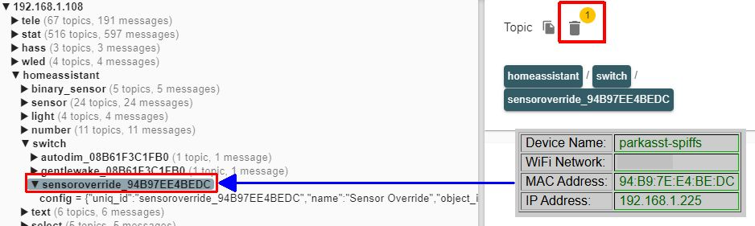

# Home Assistant and MQTT Issues
{: .no_toc }

---

  

Most MQTT and Home Assistant Discovery issues are the result of a configuration mismatch or a "stuck" message in the MQTT broker. Because MQTT is a middle-man service, troubleshooting often requires a utility that allows you to see exactly what is being broadcast.   
I highly recommend **[MQTT Explorer](https://mqtt-explorer.com/)**. It is a free, open-source tool that acts as a window into your broker, allowing you to see if the Parking Assistant is actually talking and what it’s saying.

## General MQTT Issues
If your external system doesn't seem to be receiving MQTT messages from the controller, or if the controller doesn't seem to accept MQTT commands sent, the first thing to verify are the MQTT topics and payloads.

### Case Sensitivity
 
**<u>MQTT Topics</u>** 
For most MQTT brokers, topics are <B>CASE SENSITIVE</b>!

`stat/parkasst/ledstate` and `stat/ParkAsst/LEDState` are two completely different topics.  Assure that any commands sent.. and topics listened to by an external system... exactly match the topic (including case) that you configured under the controller's [MQTT Settings](mqtt).

**<u>MQTT Payloads</u>** 
MQTT payloads may also be case-sensitive, depending upon the system that is subscribing to and using those payloads.  If the third party system sees a value of "ON" and "on" as two different values, then the external system may need to test for both values.

However, the MQTT commands (subscribe topics) for the controller will accept either lower or upper case for most payloads.  For example, any of the following are valid for sending an "on" state to the controller via MQTT:
`on, ON, On, True, true, TRUE, 1`  

When publishing a state, the controller will always use an upper case `ON` or `OFF`, which is what Home Assistant expects.

The [MQTT Topics](mqtttopics) section lists example payloads for both the published state topics and subscribed topics.  If an MQTT command isn't being processed properly, just be sure to check both the topic and case of the topic and payload.

### Topics Not Updating as Expected
 
Recall that when the system is in "Standby" mode (which also includes backing out or departing), MQTT topics are only refreshed once per defined 'tele-period' unless a settings change occurs.  This means that a car's presence, zone and sensor distances will not update upon departure until the car clears all zones and the exit time expires.

See the [Telemetry Period and When State Topics are Updated](mqtt#telemetry-period-and-when-state-topics-are-updated) for more details on when MQTT topics are refreshed.

## Home Assistant Discovery: No Device or Entities Created
If you run the Discovery process in the web app but nothing appears in Home Assistant, verify the following:

* **Prerequisites:** Ensure you’ve met all the steps in the [MQTT Setup & Configuration]({{ '/mqtt' | relative_url }}) section.
* **The Integration:** Ensure you have installed the [**MQTT Integration**](https://www.home-assistant.io/integrations/mqtt/) within Home Assistant itself. This is separate from the Mosquitto broker add-on.
* **Default Settings:** Discovery relies on standard Home Assistant conventions. If you have changed the default settings of the MQTT integration in HA, Discovery may fail.

### Home Assistant MQTT Default Parameters
Ensure your Home Assistant MQTT configuration matches the default values. If you have not modified the MQTT integration options in Home Assistant, these should be your current settings:

| Parameter | Value | | Parameter | Value |
| :--- | :---: | :--- | :--- | :---: |
| **Enable Discovery** | `ON` | | **Birth message retain** | `OFF` |
| **Discovery Prefix** | `homeassistant` | | **Will message topic** | `homeassistant/status` |
| **Enable birth message** | `ON` | | **Will message payload** | `offline` |
| **Birth message payload** | `online` | | **Will message QoS** | `0` |
| **Birth message QoS** | `0` | | **Will message retain** | `OFF` |

## Home Assistant Discovery: Deleted Entities Reappear
If you delete a device in Home Assistant but it "ghosts" back into existence after a reboot, you likely have a **retained message** stuck in your MQTT broker. 

Usually, using the **REMOVE DISCOVERY** button in the Parking Assistant's web app prevents this. However, if you’ve reset your controller or replaced the hardware, the old "discovery" messages might still be sitting on your broker, telling Home Assistant that the old device still exists.

### Cleaning Up "Stuck" Topics
To manually purge these messages using MQTT Explorer:
1. Locate the `homeassistant/` topic.
2. Navigate through the sub-topics (e.g., `binary_sensor`, `light`) to find the entry matching your old device name.
3. Highlight the specific topic and click the **Trash Can** icon to delete it from the broker.

&emsp;&emsp;

You may have a lot of discovered entities from other projects as well at this one.  If you have difficulty identifying the proper topic, all Discovery topics use the MAC address of the controller.  You can see MAC address of the controller on the main page of the web application.  Use this to identify the topics added via discovery.

Repeat the above steps for all "ghost" or reappearing entities in Home Assistant.  If the device is still present, it will be removed when the last associated entity is removed.

> **⚠️ Proceed with Caution** Only delete topics created by the Discovery process for the PARKING ASSISTANT controller! Deleting other retained messages in your broker may impact or disable other smart devices in your home. When in doubt, refer back to the [Home Assistant Discovery]({{ '/discoverymain' | relative_url }}) section for a full list of entity names.
{: .warning }

  <a href="{{ '/troubleoperation' | relative_url }}" class="btn btn-outline"><- Previous: General Operational Issues</a>
  <a href="{{ '/troublefaq' | relative_url }}" class="btn btn-purple">Next: FAQ & Getting Help -></a>

