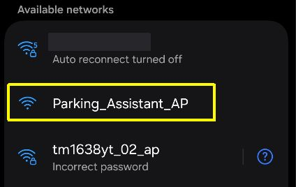
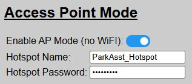
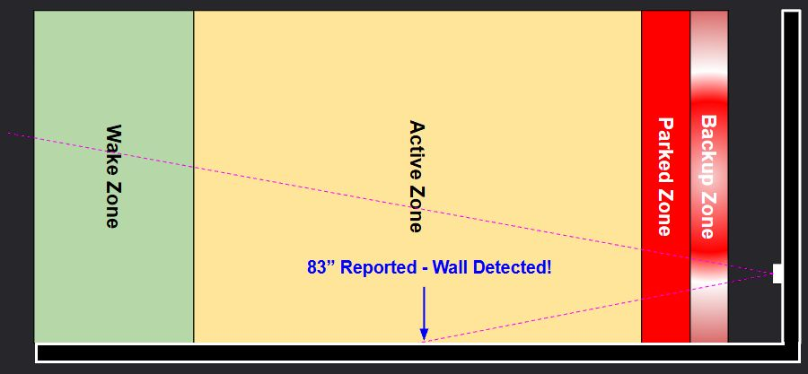
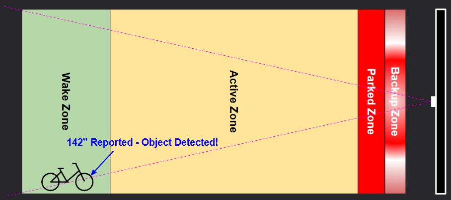

# General Operational Issues
{: .no_toc }

---

  

If you've verified your wiring, assigned GPIO pins and the other steps covered under the preceding [Configuration &amp; Hardware Issues](troubleconfig) topic, or if a previously working system suddenly stops, check the following for additional steps.

## Cannot Access Web Application
If you've completed the [Getting Started](startingmain) steps (installing and onboarding) but cannot reach the web application, check the following:

<b><u>Blue LED on the ESP32 is illuminated</u></b>

Most ESP32 boards have two LEDs... one for power and one that is controllable via a GPIO pin. By default (and unless previously disabled), the Blue LED will be illuminated when the system connects to your WiFi.  If this LED does not light up, then the system is not on your WiFi and you will be unable to reach the web app (unless running in AP Mode... see below).

<b><u>Are the LEDs on the ESP32 Flickering?</u></b>

Watch the LEDs on the ESP32 for a few moments.  If they are flickering or briefly going out and then turning on again, it is an indication that the board is stuck in a boot loop.  This is generally caused by either a bad flash or an invalid entry for the WiFi credentials.  The best bet is to try flashing the original firmware via USB cable again, as covered in the [Initial Firmware Installation](installation) section.

<b><u>Is the Onboarding HotSpot Still Broadcasting?</u></b>

Use a phone, tablet or laptop and see if the original onboarding HotSpot is still being broadcast:

The hotspot is only shown if the system is unable to join WiFi.  If this hotspot is still broadcasting, join it and try the onboarding process again, verifying your WiFi SSID and password are correct (remember that these are <i>case-sensitive</i>).

<b><u>Is System Running in AP Mode (no WiFi)?</u></b>

If you previously configured your system for [AP Mode](apmode) (no WiFi), then you must join the specified hotspot with a mobile device.  The web application will be available via a browser by using the URL:  `http://192.168.4.1`

<b><u>Check Local Network Settings</u></b>

If operating using normal WiFi mode, check your router/firewall settings to assure communications between the controller and device attempting to display the web application are not being blocked or otherwise prevented.  The system does not require any special configuration other than standard HTTP traffic.  But the system needs to both initiate and respond to HTTP requests.  Note this if using VLANs and update your rules accordingly.

>🌐 **Arduino OTA Updates** The only network exception to the above is that is you are using the Arduino IDE to modify the firmware and want to flash your modified code over-the-air (without connecting via USB cable), the OTA functionality requires mDNS.  This is an Arduino IDE requirement to map virtual ports.  If you aren't planning to modify the firmware or will flash via USB, then mDNS is not required for any other function.
{: .important}
 
## System Will Not Exit Standby Mode

This is probably one of the most common issues I hear about... and the cause is almost always the same.

Recall from the [How the Parking Zones Work](zones) topic, the system will not "arm" and be awakened by a vehicle until all zones have first been cleared.  Odds are, your front sensor is detecting an object within one or more of the zones, even when they appear to be empty.

 
<i>Sensor placed too close to side wall</i>

 
<i>Stationary object exists in a zone</i>

If a stray lawnmower or garbage can sits 2 inches inside the Wake Zone, the sensor will stare at it indefinitely like a cat watching a ceiling fan. Clear all obstacles from the zones so the system can re-arm for the next arrival.

Use the [Calibration Mode](sensorcalibrate) to verify the actual distance being reported by the front sensor.  If it is reporting a distance less than the Wake Zone distance even when the zones should be "empty", odds are either it is detecting an unexpected object... or the sensor is faulty or returning an error code.

## Other Operational Issues
There are various other reasons why the system may not be responding as expected.  The following are some of the most common reasons... and how to resolve them.

### Verify Sensor Override Settings
Recall that the system has a [Sensor Override](sensoroverride) feature.  If this option is enabled/ON (enable via either the web app or by an external MQTT/API call), then the parking process is bypassed and nothing will happen with the LEDs.  Use the web application to check this setting and turn 'OFF' to return the system to normal operation.

### System was left in Calibration Mode
Also recall from the [Calibration Mode](sensorcalibrate) topic, when calibration is active, all other features are secondary... including how the system responds to a parking car.  Exiting the calibration page and returning to any other page in the web app exits calibration mode.

However, if you simply closed the browser without exiting calibration mode, it will remain in the 'calibration state'... impacting normal operation.  If this occurs, just relaunch the web application.  Just loading the main page will exit the preceding calibration mode.

### Other Issues Not Covered Above
If the hardware is operating correctly, most other operational issues are usually related to misconfigured settings... for example, having a 'active' zone distance that is greater than the 'wake' zone distance.  The web application generally prevents these sort of configuration errors, but if MQTT or the API are used to set these values, these checks are not executed.

Some other common misconfiguration issues include:

- <i>Setting any LED color to "Black" (or other very dark color).</i>  The LEDs may appear in an 'off' state when technically they are on and functioning.  Avoid use of any dim/dark colors for any of the Zone settings (except maybe 'Standby' - although a standby brightness of "0" is recommended over using a black/dark color if you wish to disable the standby indicators).

  - >👉 **Disabling the Standby Indicators** If you wish to disable the Standby indicators, it is recommended to set the Standby Brightness to "0" as opposed to assigning a black or other dark/non-visible color.
{: .note}

- <i>Setting Running Brightness Too Low</i>.  Similar to using a dark color, setting the running LED brightness level too low may not illuminate the LEDs.  As a general rule, be sure the running LED brightness has a value of at least 5 or greater.

## Still Having Issues?
If none of the above, or other troubleshooting steps do not resolve your issue, then see the [FAQ &amp; Getting Help](troublefaq) topic for additional options.

  <a href="{{ '/troubleconfig' | relative_url }}" class="btn btn-outline"><- Previous: Config &amp; Hardware Issues</a>
  <a href="{{ '/troublediscovery' | relative_url }}" class="btn btn-purple">Next: Home Assistant &amp; MQTT Issues-></a>

