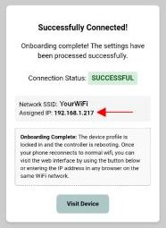
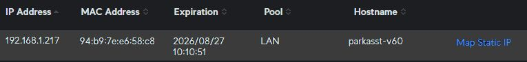

# Initial Setup & Connectivity Issues
{: .no_toc }

---

  

This section covers the initial flashing of the binary firmware and the onboarding steps. If you are attempting an upgrade of existing firmware or are trying to flash source code from an IDE, please refer to the [Firmware Updates]({{ '/firmwaremain' | relative_url }}) or [Advanced Technical Information]({{ '/advanced' | relative_url }}) sections instead.

## Installation Issues
Getting the firmware onto the ESP32 is usually the hardest part. If the computer and the controller aren't talking, check these common culprits.

> **🚦 Parking Assistant Installer Use Recommended** The [official installer](installation#-install-full-firmware-here) provided right here within this site is the recommended method of initially installing the firmware. If you installed the firmware using a third-party tool, you should attempt a reinstall using this method first.
{: .important}

### No COM Port Found
When you connect your ESP32 to your PC, you must select a COM port. If no new port appears, you are likely missing the USB-to-Serial drivers.

> **💡 Note** These drivers are provided by third parties. Use caution when downloading and installing files. If the standard drivers fail, check your PC manufacturer's site (especially for Lenovo laptops).
{: .note }

* **[CP2102 Drivers](https://www.silabs.com/software-and-tools/usb-to-uart-bridge-vcp-drivers?tab=overview)** – Windows and Mac.
* **CH342, CH343, CH9102 Drivers:** **[Windows](https://www.wch.cn/downloads/CH343SER_ZIP.html)** \| **[Mac](https://www.wch.cn/downloads/CH34XSER_MAC_ZIP.html)**
* **CH340, CH341 Drivers:** **[Windows](https://www.wch.cn/downloads/CH341SER_ZIP.html)** \| **[Mac](https://www.wch.cn/downloads/CH341SER_MAC_ZIP.html)**

*If the driver pages appear in Chinese, right-click and select "Translate to English" in your browser, or look for the "down arrow" (↓) download button. I did not develop nor am I responsible for these drivers. Install and use at your own risk!*

### ESP32 Will Not Connect
If the drivers are installed but the board won't connect, you may need to perform the "Boot Button Dance" to force the board into flashing mode:

1. Hold down the **BOOT** button on the ESP32.
2. Apply power (plug in USB) or press the **EN/RESET** button while still holding BOOT.
3. Release both buttons simultaneously.

### Flash Succeeds, but no Hotspot Appears
If the flash finishes but you don't see an onboarding access point, the flash was likely incomplete or corrupt. Erase the flash and try again. If the problem persists, try a different utility:

1. **[ESPConnect](https://thelastoutpostworkshop.github.io/ESPConnect/) (Recommended Alternative)** – Requires a Chromium-based browser and internet connection.
2. **[ESPHome Web Flasher](https://github.com/esphome/esphome-flasher/releases/latest)** – A reliable desktop alternative.
3. **[NodeMCU PyFlasher](https://github.com/nodemcu/nodemcu-flasher)** – Use as a last resort (Windows only).

If all else fails, you may need to try compiling and flashing the source code from the Arduino IDE. It is possible that there is a compatibility issue with your particular ESP32. See [Modifying the Firmware](modifications) for more information on using the Arduino IDE to flash the firmware.

## Onboarding Issues
Once the flash is successful, the controller broadcasts a Wi-Fi hotspot. You should see a network named: `PARKING_ASSISTANT_AP`. If you do not see this hotspot after power cycling the ESP32:

* **Check the Network:** Ensure your phone or laptop is searching on the same Wi-Fi frequency (2.4GHz).
* **Proximity:** The ESP32 doesn't have the broadcasting power of a high-end router. Stay in the vicinity of the controller during this process.
* **Wait for it:** It can take 2–3 minutes for the hotspot to initialize. If it never appears after a power cycle, refer back to the flashing troubleshooting above.

## Obtaining the Controller IP Address
The onboarding process will show you the newly assigned IP address if it successfully joins your WiFi. 

However, if you missed noting the new IP address or if you disconnected your device from the Hotspot before the onboarding completed, you can still use your router to get the IP address.

If supported by your router, the Hostname should match the Device Name you assigned during onboarding.

> **💡 Static or Reserved IPs Recommended** As covered in the [Onboarding](onboarding) Topic, assigning a static or DHCP reservation for your device is recommended.  This is especially true if using external interfaces such as the HTTP API, as these use the IP address of the Parking Assistant controller for communication. If the IP address of the controller changes, the external interfaces may cease operation until they are reconfigured for the controller's newly assigned IP address.
{: .important }

In addition, if the IP address of the controller changes, it changes the IP address you use to access the embedded web application.  If your system suddenly stops working or you can no longer access the web interface, check your router to assure the controller did not get assigned a new IP address.

  <a href="{{ '/troubleshooting' | relative_url }}" class="btn btn-outline"><- Previous: Troubleshooting Overview</a>
  <a href="{{ '/troubleconfig' | relative_url }}" class="btn btn-purple">Next: Configuration &amp; Hardware Issues -></a>

