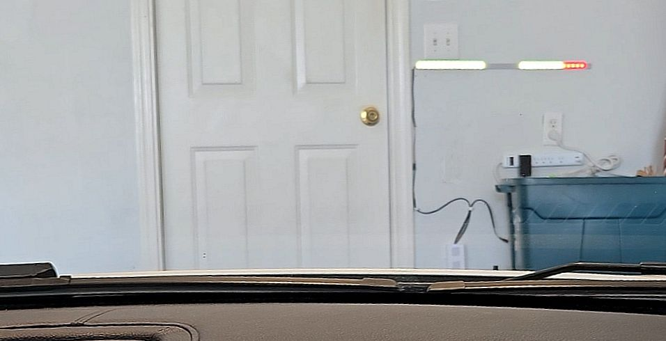
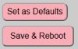
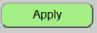
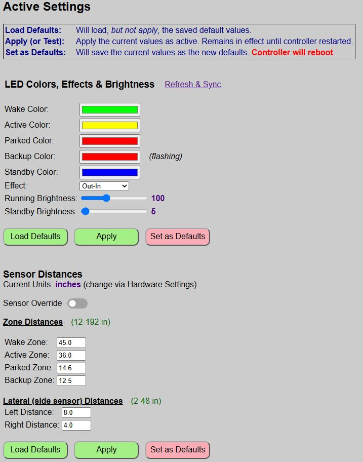

# General System Use
{: .no_toc }

---

  

This is where the magic happens. Now that you've done the hard work of flashing, wiring, configuring, and installing the system, it's time to actually put it to work.. Whether you're adjusting colors or zones via the web app or controlling the system via MQTT or the API, these pages cover the "how-to" of your new ESP Parking Assistant.

## Understanding Active vs. Default Settings

While this was also covered under the [Web App Overview](webapp) topic, it's worth repeating here.  Up until this point, we've primarily covered the default settings.  But there is another group of settings called the active settings.

### Default Settings
These are the settings that are saved to a local configuration file and are automatically loaded any time the controller boots up.  This includes the previously covered hardware settings, but also things like the LED color, effect and zone distances along with the LED brightness have default settings that are saved as part of the configuration.

### Active Settings
Active settings are ones you make via the web application (or via MQTT/API) that are in effect for the current active session.  They remain in effect until changed or until the controller reboots, at which point the default settings become active.

### How to Determine Which Settings are Being Modified
As a general rule, any page or section that is going to make changes to the saved defaults will have a button labeled as either "Save & Reboot" or "Set as Defaults".

These buttons also have a reddish/pink background to indicate they will make a permanent change to the configuration file.  Buttons that say "Apply" or have a green background generally mean that the values will only update the ACTIVE settings.  

Active settings are applied immediately, which is another clue.  Changes to DEFAULT settings always require a reboot to save/reload any changes.  All **active** changes are made on the main page of the web application.

  

---

### In This Section
* **[Setting Zone Distances]({{ '/zonedistance' | relative_url }})** - Configure zone trigger distances.
* **[Zone Colors and Effects]({{ '/zonecolors' | relative_url }})** - Assign colors, the approach effect and overall LED brightness.
* **[Sensor Override]({{ '/sensoroverride' | relative_url }})** - Temporarily disable the sensor(s) for manual system control.

At a minimum, you will need to configure the zone distances for your particular parking area.

  <a href="{{ '/apmode' | relative_url }}" class="btn btn-outline"><- Previous: Access Point Mode</a>
  <a href="{{ '/zonedistance' | relative_url }}" class="btn btn-purple">Next: Setting Zone Distances -></a>

