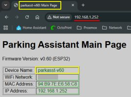
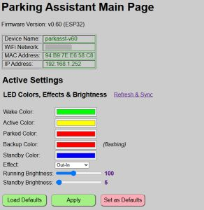
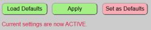
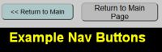

# Web Application Overview
{: .no_toc }

---

  

The controller has its own embedded web application and settings. While some system features can be controlled via MQTT, API, or via Home Assistant, the web application is the **only** interface that provides access to every available setting and option and is the only place where hardware settings can be specified.

> **🌐 Hosted Locally (No Cloud or Apps Required)** The entire web interface is served directly from the ESP32's memory. It’s a remarkable feat of engineering when you consider that a chip the size of a postage stamp is doing the work of a web server on top of all its other processing. Just remember that it’s not a supercomputer—if you mash the "Refresh" button like you're trying to win a radio contest, the ESP32 might get a little overwhelmed and take a brief, unscheduled nap.
{: .note }

---

## Accessing the Interface
The application is fully responsive and accessible via any modern web browser on the same network as the parking system. 

> **💡 Hint:** For the best experience on a smartphone, rotate your device to **landscape mode**.
{: .note }

To access the web app, enter the IP address of your controller (e.g., `192.168.1.252`) into your browser's address bar. 

  

_The actual main page will look slightly different as the above image just shows a small portion._

## Identifying the Current Controller
If you are running more than one Parking Assistant, there are several visual indicators to help you identify which system is currently active in your browser (see the image at the top of this page).

An **information block** at the top of the main page contains controller-specific information:

Value | Meaning
-----|----
**Device Name**|Lists the unique name you assigned during onboarding
**WiFi Network**|Shows the currently used WiFi Network.  If operating in access point mode, this will show 'AP Mode' followed by the hotspot name.
**MAC Address**|Shows the ESP32's hardware MAC address.
**IP Address** | Current IP address of the system.

**Version Number:** The current firmware version is also shown at the top of every page.

**Browser Tabs:** The tab in your browser will automatically update to show the device name of the active system.

## Understanding 'Active' vs. 'Default' Settings

For many of the systems settings and options, there are actually two different values: **Default** settings and **Active** Settings.  This includes options like zone colors and distances, LED brightness, active zone effect, etc.

### Default Settings

Default settings are saved in a special non-volatile configuration file on the ESP32.  Default values are those that are loaded and active whenever the system boots.  These defaults can be changed and updated, but when updated, the system will save the values to the configuration file and then reboot to load up those new values.

Within the web application, a light red color button indicates that the current section's settings will be saved as new defaults (followed by a reboot).

### Active Settings

Active settings are changes made via the web app (or via MQTT/API) that are used for the current session.  They will remain in effect until changed again or **until the system reboots**.  When the system reboots, any 'active' settings that have not been saved will be lost and the boot 'default' settings will be loaded again.

Within the web app, a light green 'Apply' button appears under those sections where active settings can be used.

When active settings are applied, the system provides two indications that the new values were accepted and are now in use.

The web page will briefly display a message under the buttons to show that the current changes have been successfully applied.  This message vanishes after a few seconds.

In addition, when new active settings are applied, the LED strip will briefly flash green.  This is just a secondary indication that your active changes have been applied successfully.

## General Navigation

Because the system supports external integrations via MQTT or the HTTP API (covered in later sections), it is possible that the state or settings shown on the web page might not reflect the actual current state.  This is most likely to occur when using the browser's navigation buttons (e.g the 'back' button) because it may load a cached version of the page.

For this reason, most secondary pages of the web application contain navigation buttons to return to the prior page or to return to the Main Page.  You should use the provided navigation buttons, and not the browser's buttons to navigate to different pages of the web app.

  <a href="{{ '/setupmain' | relative_url }}" class="btn btn-outline"><- Previous: Setting Up the System</a>
  <a href="{{ '/initconfig' | relative_url }}" class="btn btn-purple">Next: Initial Hardware Config -></a>

