# Setting Zone Colors and the Approach Effect
{: .no_toc }

---

  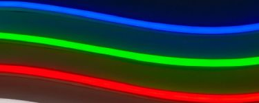

Each of the parking zones can be assigned a different LED color.  In addition, the Active (or approach) zone can use different effects to indicate the approach to the Parked zone.  

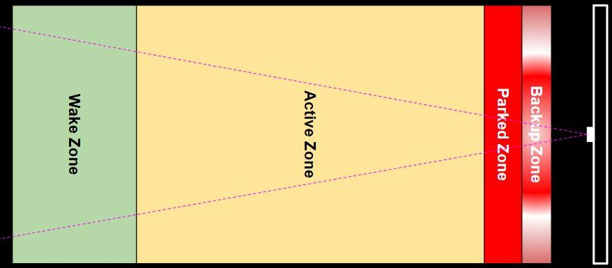

Again, these settings can be found on the main page of the web application.
  
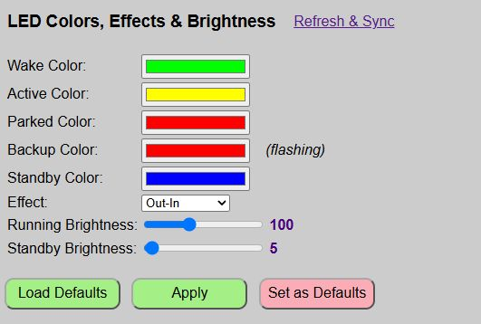

Zone | LED Strip
---|---
Wake | When a vehicle first enters the Wake zone, all LEDs will light up in the Wake Zone color.
Active|The LEDs will begin to light up using this color and the selected Effect (see below).
Parked|The entire LED strip will light up in this color.
Backup|If the vehicle pulls too far forward and enters the Backup Zone, the entire LED strip will rapidly flash in this color.
Standby|A special color for when the system is in sleep/standby mode.  Only lights one LED on each end of the strip in the selected color (and with the standby brightness). See below for more information on the Standby color and mode.

---

### Selecting a Color

To select a color for any of the zones (or standby), simply click in the color box to display a color picker.

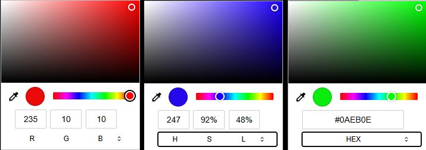

From the color picker, you can simply click the desired hue on the spectrum and fine tune via a click in the larger top box.  Alternatively, you can enter a RGB color value  directly in the numeric boxes, or by clicking the small double arrows, enter a color in HSL or even Hex.  In addition, you can actually select any color from the computer's desktop using the small eye dropper.  When the desired color is selected, just click anywhere outside of the color picker.

<b><u>Picking Colors on a Mobile Device</u></b>

If you are accessing the web application on a mobile device, the color selection process may appear differently depending upon the device and operating system.  For example, here's how the color picker appears on my Android phone:

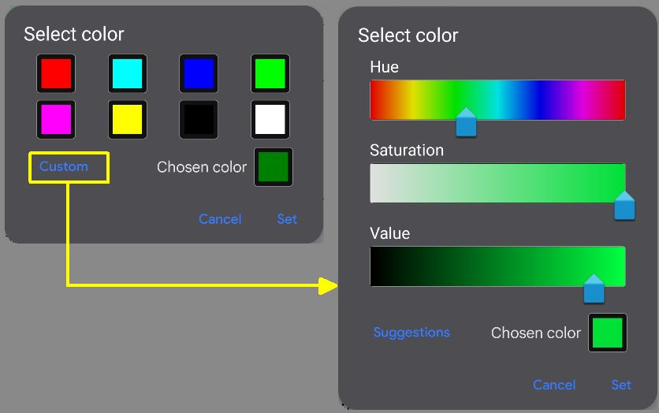

---

### Selecting the Active Zone Effect
While the other zones (wake, parked and backup) light up the entire LED strip in the chosen color, the Active Zone works a bit differently, lighting up the LEDs as the vehicle approaches the Parked zone.  The best way to view these effects are to simply try them out, but I'll provide an overview of the currently available options.

<b><u>Out-In</u></b>  
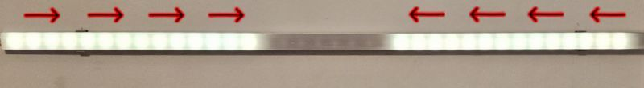 
With this effect, the outermost pixels on each end light up when the vehicle first enters the active zone. Successive pixels light up towards the center as the vehicle approaches the parked zone, meeting in the middle just before hitting the parked zone.
  
<b><u>In-Out</u></b>  
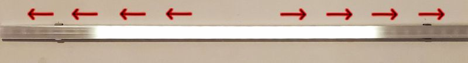 
This is basically the opposite of 'Out-In'. The LEDs start in the middle and move towards the outside edges as the vehicle approaches the parked zone.
  
<b><u>Full-Strip</u></b>  
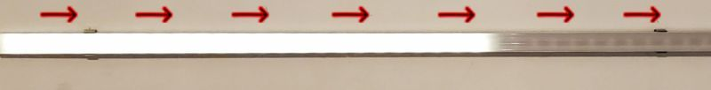 
This effect uses the entire LED strip, starting with lighting up the pixel closes to the 'wired' end of the LEDs and lighting up pixels towards the opposite end with the entire strip lit just prior to entering the parked zone. Note that since this effect (and its reversed opposite below) uses all the pixels instead half on each end like the previous two effects, sensitivity will basically be doubled for the same given active zone distance.
  
<b><u>Full-Strip-Inv</u></b>  
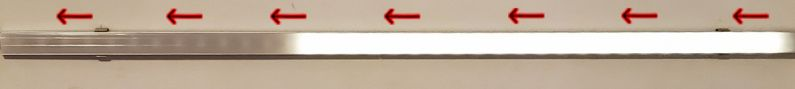 
As you might guess, this is just the opposite of the previous Full-Strip effect where the LEDs begin at the 'non-wired' end of the LED strip and light up in series as the car approaches the parked zone.

The full strip effects might be useful in a situation where you need to mount your LED strip vertically instead of horizontally due to limited mounting space on the wall.
  
<b><u>Solid</u></b>  
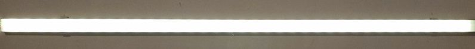 
This really isn't an effect, but will simply turn the entire LED strip on in the color specified in the settings. The strip remains this color until the vehicle enters the parked zone. There is no indication or change as the car moves through the active zone... the strip just remains solid through the entire active zone. Think of it more like a stoplight effect. Probably not very useful, but it is included in case you have a special use case and don't want any of the other 'countdown' style effects.

---

### Lateral Guidance Color and Effect
If a side sensor is installed and enabled, approximately 15% of the total LED count will be used to flash the LEDs on the left or right when the vehicle strays outside the lateral guidance distance. For example, if you have a total of 35 LEDs, then 5 LEDs will flash on either end to indicate a correction is required when parking.

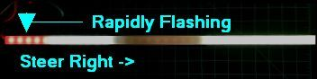 

Note that the lateral guidance LEDs share the same color as the 'Backup Zone' color and will flash rapidly when activated. See the sections on [Hardware Configuration](initconfig) and Using the Web Inteface for more info on enabling lateral guidance.

---

### Standby Mode and LED Color
When the system enters standby mode after either the park or exit times expire, the LEDs will illuminate one LED at each end of the strip in the selected color.  

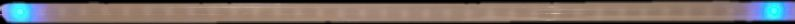 

The standby mode also has its own brightness setting so that you can use a lower brightness level when the system is asleep.  If you want to completely disable the standby indicators, simply set the standby brightness to 0.  See the next section.

---

### LED Brightness

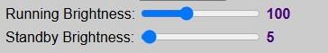 
There are two LED brightness level settings:

<b><u>Running Brightness</u></b>: The brightness of the LEDs when 'Active' and tracking a vehicle's approach. Valid values are from 1 - 255, but at very low levels (<5), the LEDs may not appear to illuminate.

<b><u>Standby Brightness</u></b>:  This is the brightness of the two standby indicator LEDs when the system is in standby or sleep mode.  Valid values are 0-255.  If you wish to disable the standby indicators, simply set the brightness to 0.

## Testing and Saving Colors &amp; Effects
This is the same method as used for setting up and testing zone distances.

When testing the system, you can rapidly check different values via the 'Apply' button.  The 'Apply' button will immediately apply your color, effect and brightness changes without the need to reboot the controller each time a change is made.  When you 'Apply' changes, the system provides two different confirmations that the changes are now active.

The web page will display a brief message under the buttons to confirm that current values have been applied.

The LED strip will also briefly flash green to confirm new values are now active.

You can now test your new colors and effect, and continue to change/apply/test different combinations until you have them set to the best options for your situation.

### Load Defaults
At any point in time, you can reset the colors, effect and brightnesses to the last saved defaults by using the 'Load Defaults' button.  _This does not **apply** the default values... it simply loads them.  If you wish to make the defaults 'active', you must 'Apply' them after loading._

### Saving Distances
Once you have your options set as desired and wish to make them the new default values, be sure to save them the 'Set as Defaults' button.  This will write your current selections to the saved configuration file, reboot the system, and load up these new values.

>⚠️ **IMPORTANT** If you do not save your new options and the controller restarts for _any reason_ (power outage, etc.), then the last saved colors, effect and brightnesses will be used.  Just assure you click the 'Save as Defaults' if you wish to make your selections the new defaults.
{: .important}

Next, we'll cover a few useful controller commands that might be handy from time to time.

  <a href="{{ '/zonedistance' | relative_url }}" class="btn btn-outline"><- Previous: Setting Zone Distances</a>
  <a href="{{ '/sensoroverride' | relative_url }}" class="btn btn-purple">Next: Overriding the Sensors-></a>

