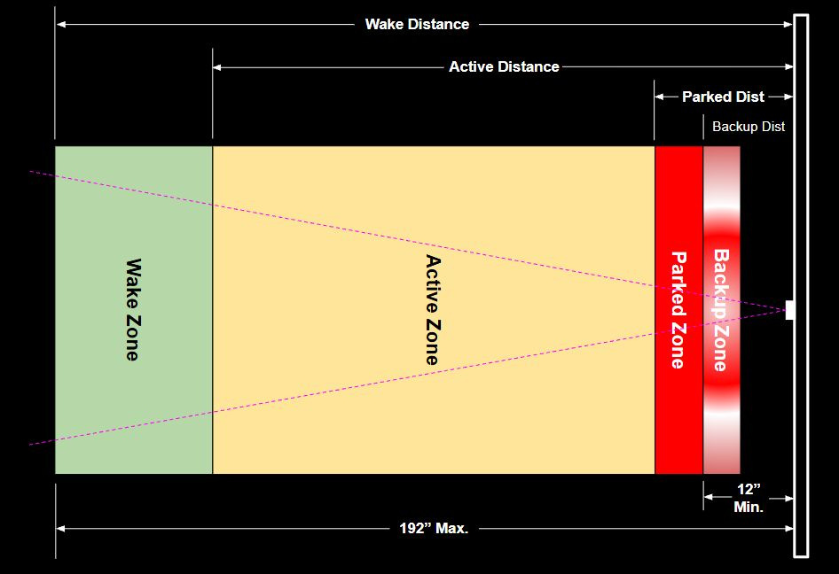
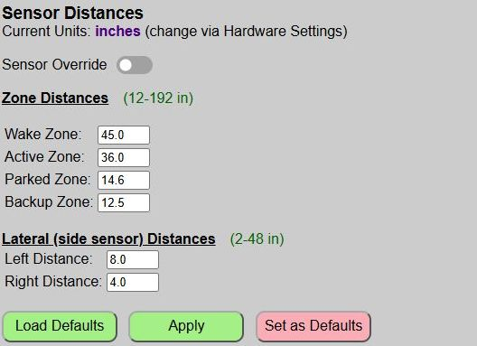
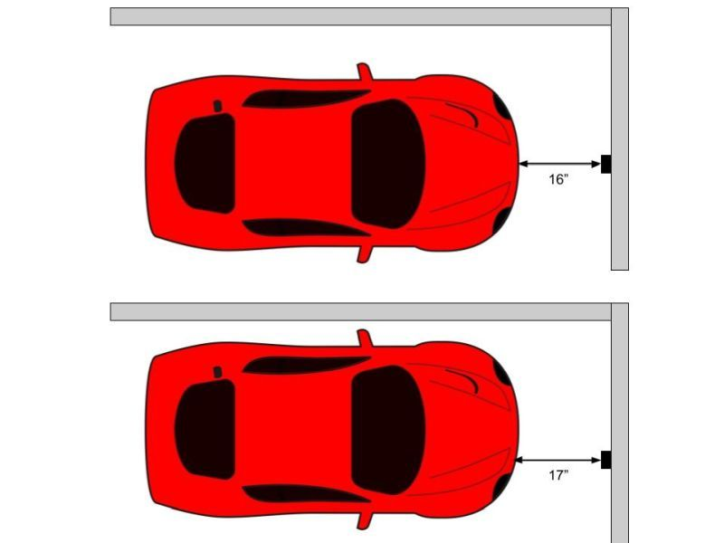
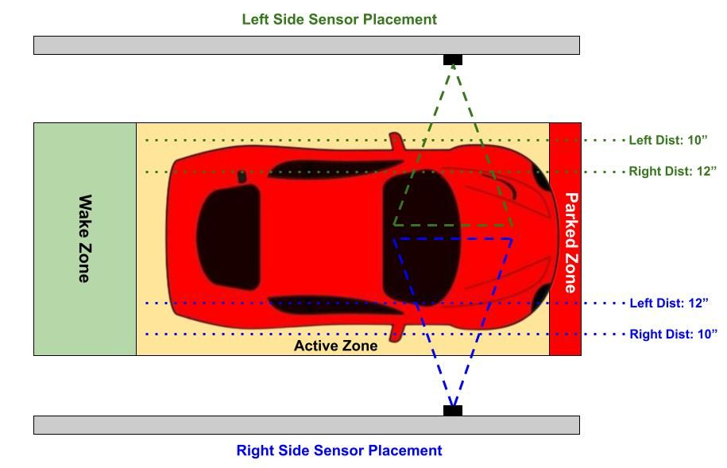
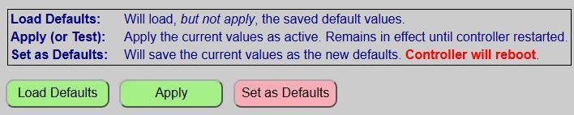
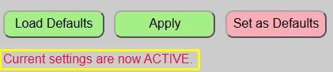
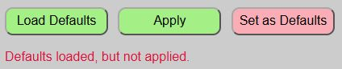

# Setting Zone Distances
{: .no_toc }

---

  

Before configuring your Zone distances, it is very important that you understand how the [Parking Zones](zones) work.  Review that topic if you are unsure.  Incorrectly setting the zone distances could result in the driver contacting a wall or other object.

>❗ **CAUTION** Be sure to thoroughly test your configuration before attempting to use it with an actual vehicle.  <i>I cannot be responsible for damage that might occur due to use of this system.  It has proved very reliable in my use, but final responsibility for proper setup, testing and use are entirely yours!</i>
{: .warning}

I strongly recommend you start by initially configuring your zones using a medium-sized objects like a rolling garbage can or even a 2-3 ft. square of cardboard.  Using these, you can set your initial zone distances.  Only when you feel your zones (especially the parked and backup zones) are close should you attempt to use an actual vehicle.

It will likely take a few attempts to get the zones just right and you will probably even adjust them a time or two after you put the system in use.  But once 'zeroed in', you should not need to change the distances unless the parking area changes or a different vehicle is used.

## Testing and Applying Distances
Zone distances are entered and applied from the main web application page.

Distances are entered in your preferred unit of measure, inches or millimeters.  You can change this at any time via the [Hardware Settings](initconfig).  When you switch units, any current distance values are automatically converted for you.  When using inches, you may enter tenths of an inch.  Millimeters can only be entered as whole values.

>🧮 **Unit Conversions** Internally, the system always uses millimeters.  When inches are selected, an internal conversion is used for displaying and saving the millimeter values as inches.  Converting back and forth may result in a small change (one millimeter or maybe a tenth of an inch) due to simply rounding.  If you switch units after the system has been configured, you should verify distances after conversion.
{: .note}

**Sensor Override**: The Sensor Override is used to bypass any sensor readings to take manual control of the LED strip.  This is normally done when using an external system via MQTT or Home Assistant Discovery to control the LEDs.  See the separate topic [Overriding the Sensors](sensoroverride) for more information.

### General Zone Distance Entry Notes
Refer to the diagram at the top of this page.
- All zone distances refer to the outer, leading edge of that zone (furthest from the sensor).

- Due to the range of the TFMini, all ranges must fall between 12-192 inches (305-4980 mm)

- The Wake zone should be shorter than the distance to the closed garage door when no car is present.  Otherwise, the sensor will "see" the garage door and will never enter the armed state.  Be sure the system is reporting "no car" when no car is present.

- Distance must _decrease_ from the wake zone through the backup zone.  An error will be displayed when you attempt to apply or save the distances if this condition isn't met.

- Ideally, the Parked zone should be as large as possible, while still meeting your requirements (e.g. clear of door, etc.).  The larger the zone, the more flexibilty (especially when no side sensor is in use).  Setting a Parked zone that is only an inch wide could make it very difficult for the driver to perfectly park the car, for no other reason than the curved front end on most vehicles will change the distance reading if the car is laterally in a different location.  

  

## Lateral (Side Sensor) Distance Entry Notes
_If the side sensor has not been enabled in the [Hardware Configuration](initconfig) or if the sensor was not detected on boot up, this section will be disabled and the distance fields will be hidden._

The side sensor distances are dependent upon whether the sensor is located on the left or right side of the vehicle.

  

Note how the side sensor distances are "flipped" when installed on the opposite side.  Using the left side as an example in the above image, when a car strays closer than the 'left' 10 inch setting, the left end of the LED strip will rapidly flash to indicate the driver should veer right.  If they stray greater than the 'right' 12 inch setting, then the right side of the LED strip will rapidly flash.

But when the sensor is on the opposite wall, those same distances are reversed.

- Due to the range of the VL53L0X, distances must be between 2-48 inches (50-1220 mm).

- When the sensor is on the LEFT side, the left distance must be less than the right distance and vice versa.

- Similar to the Parked zone, try to make the lateral zone as wide as possible while still meeting your requirements.  Setting a very narrow lateral zone will likely cause the LEDs to rapidly alternate between "steer left" and "steer right", frustrating the driver and making it difficult to get the car in the proper lateral position.

## Testing and Saving Distances

When testing the system, you can rapidly check different values via the 'Apply' button.  The 'Apply' button will immediately apply your changes without the need to reboot the controller each time a change is made.  When you 'Apply' changes, the system provides two different confirmations that the changes are now active.

The web page will display a brief message under the buttons to confirm that current values have been applied.

The LED strip will also briefly flash green to confirm new values are now active.

You can now test your new distances and continue to change/apply/test the distances until you think you have them properly configured.

### Load Defaults
At any point in time, you can reset the distances to the last saved defaults by using the 'Load Defaults' button.  _This does not **apply** the default values... it simply loads them.  If you wish to make the defaults 'active', you must 'Apply' them after loading._

### Saving Distances
Once you believe you have your distances set correctly, be sure to save them as the default values using the 'Set as Defaults' button.  This will write your current distances to the saved configuration file, reboot the system, and load up these new values.

>⚠️ **IMPORTANT** If you do not save your new distances and the controller restarts for _any reason_ (power outage, etc.), then the last saved distances will be used, which might be an issue!  Just assure you click the 'Save as Defaults' to make your zone distances the new defaults.
{: .important}

Next, we'll take a look at setting different zone colors, the approach zone effect and the LED brightness levels.

  <a href="{{ '/usingmain' | relative_url }}" class="btn btn-outline"><- Previous: General System Use</a>
  <a href="{{ '/zonecolors' | relative_url }}" class="btn btn-purple">Next: Zone Colors & Effects-></a>

