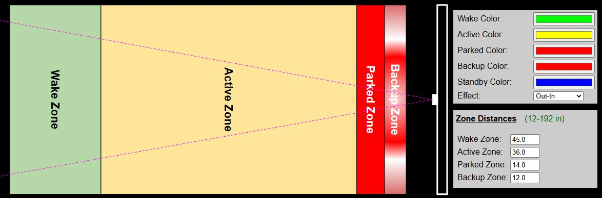
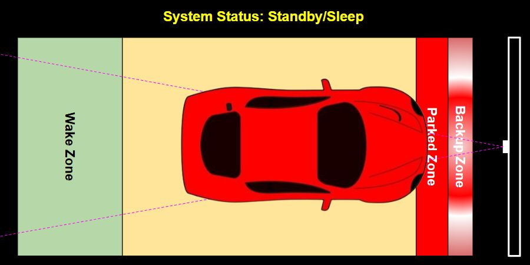
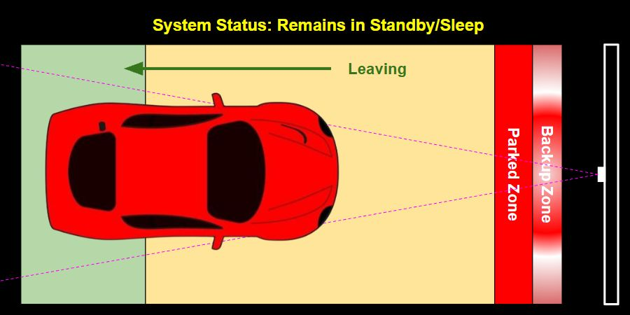
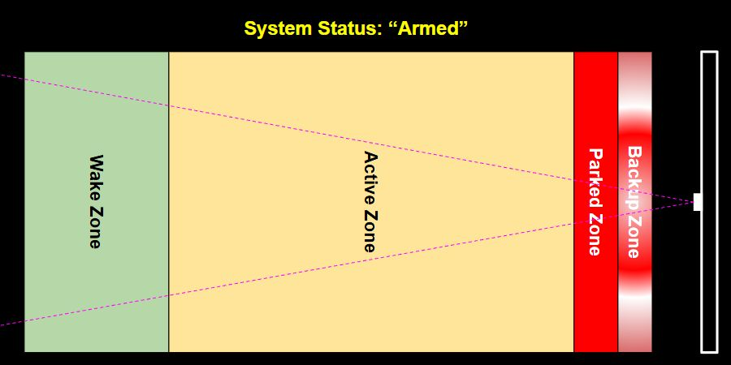
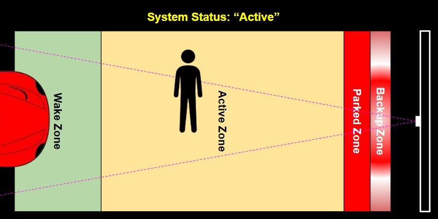
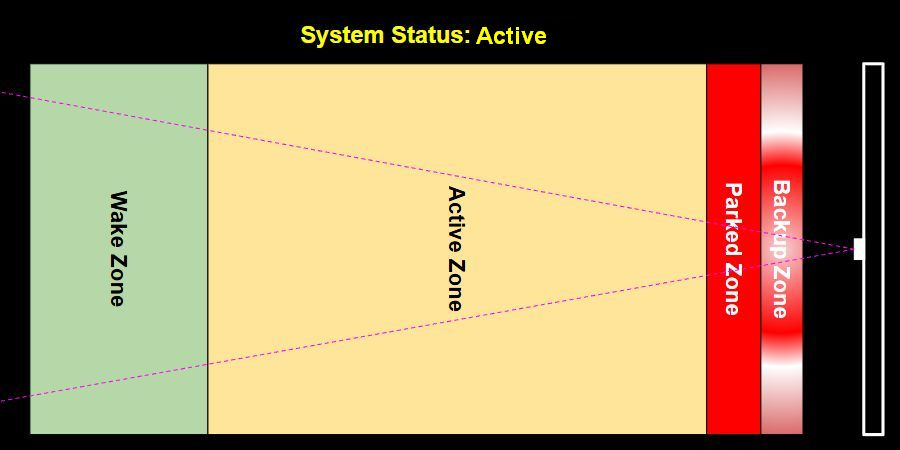

# How the Parking Zones Work
{: .no_toc }

---

  

To understand how the system works, specifically for some options like the Park and Exit times, it is important to understand how the system operates.

When a car is parked and the system is in standby/sleep mode, it does not awaken when the car pulls out (no real need for front guidance when backing out).  So the system only wakes and enters active mode when all zones are empty and a vehicle (or other object) is detected entering one of the zones.  Normally this will be the wake zone when a car is parking.  A few examples may help with understanding the operation.

### Car Parked

**System Mode**: Standby 
**Timers**: Inactive

Once a car is parked and the active park time has expired, the system enters standby mode.  It remains in standby mode as long as any zone is occupied.  This means you can walk through a zone, or even between the front of the car and the sensor, and the system will remain asleep.

### Car Departing

**System Mode**: Standby 
**Timers**: Inactive

When in standby mode, the system remains asleep as long as an object continues to be detected in any zone.  This means the system does not 'activate' when backing out of the garage.  This is by design, since guidance is really meaningless when leaving.  

### All Zones Vacant - Armed Mode

**System Mode**: Standby (armed) 
**Timers**: Inactive

Once all zones have been cleared, the system is now "armed".  It is now ready to activate whenever any object is detected entering any zone.  Normally this will be the Wake zone when a car approaches.

### Zone Entered

**System Mode**: Active 
**Timers**: Park Timer Started

Once the system is armed, any object that enters a zone will trigger the system and exit standby mode.  Normally this would be a vehicle entering the wake zone, but the system will awake even if someone simply walks into a zone.  As long as an object remains in a zone, the system remains active (with the LEDs on) until the **Active Park Time** expires.

### Zones Vacated Before Park Time Expires

**System Mode**: Active 
**Timers**: Exit Timer Started

If the system is awakened by an object entering a zone, but all zones are vacated before the park time expires (e.g. the car reversed directions and leaves the wake zone or someone walking past the sensor exits all zones), the 'Active Park Timer' is cancelled and the 'Exit Park Timer' begins.  Once the exit park time expires, the system once again goes into Standby mode, but will remain 'armed' for the next zone entry.

>👉 **System is only armed once all zones are empty** As described above, once the system enters standby or sleep mode with an object is present in any zone, the system will **remain** in standby mode and will not 'arm' until _all_ zones have been vacated.  When a parked car is present, you can freely pass through any zone without waking the system.
{: .important}

## Setting Appropriate Park and Exit Times

Based on the above information, set your Park and Exit times accordingly:

- **Park Time**: Set this to allow ample time for the driver to enter the wake zone and position the car in the final parked location.  Allow extra time in case they need to back up or otherwise adjust the car.  The LEDs will automatically turn off and the system will enter standby mode once the Park Time expires, regardless of where the car is located within the zones. 60 seconds is probably a good starting time.

- **Exit Time**:  This is only triggered when an object enters a zone but then clears all zones before the Park Time expires.  This normally happens when the car is absent but someone simply walks through a zone.  In this case, you don't need the LEDs to remain lit for the entire park time duration.  Instead, set this to a shorter time so the lights simply turn back off and the system returns to standby/armed mode.  5-10 seconds is probably a good starting time.

  <a href="{{ '/initconfig' | relative_url }}" class="btn btn-outline"><- Previous: Hardware Configuration</a>
  <a href="{{ '/sensorcalibrate' | relative_url }}" class="btn btn-purple">Next: Sensor Calibration -></a>

